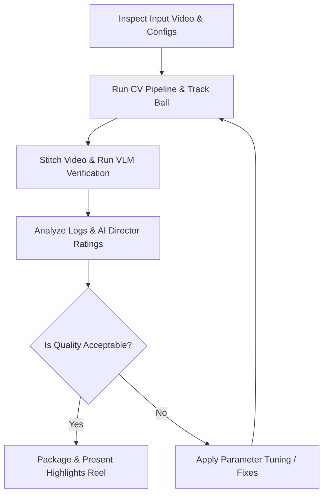

# 🤖 TTHAC Workspace Rules, Guidelines & Agentic Specification

This document defines the workspace rules, development constraints, and autonomous tuning workflows for any agent working within the Ping Pong Highlight Clipper (TTHAC) repository.

---

## 🛠️ Project Constraints & Standards

### 1. Cross-Platform Directory Paths
* **Rule**: NEVER hardcode Windows-specific absolute paths (like `D:/...`).
* **Reason**: Development and deployment occur on Linux environments.
* **Practice**: Always use `Path` from python's `pathlib` with relative or workspace-relative directories (e.g., `./storage`).

### 2. Fast Cutting & Quality Control
* **Rule**: Keep FFmpeg stream copy (`-c copy`) for video clipping. Do not introduce slow re-encoding (`moviepy` heavy renders) unless dynamic overlays are explicitly requested.
* **Reason**: Highlight clipping must be processed instantly.
* **Practice**: Maintain clean console outputs via progress bars (`tqdm`) or quiet commands.

---

## 🔄 The Agentic Workflow Loop

When operating autonomously, the agent runs in a closed-loop cycle: **Inspect ➡️ Run ➡️ Evaluate ➡️ Tune ➡️ Re-run**.



### 1. Pre-Run Inspection & Environment Setup
Before executing the pipeline, the agent checks:
* **Operating System**: Detect the current host OS and normalize paths in [config/settings.py](file:///home/ubuntu/projects/pingpong-auto-highlight/config/settings.py).
* **Dependencies**: Verify `ffmpeg` is installed.
* **Video Metadata**: Check duration, frame rate, and resolution.
* **API Credentials**: Check if `GEMINI_API_KEY` is present. If set, VLM AI Director features will be enabled automatically.

### 2. Pipeline Execution & Monitoring
Run the CLI tool and capture metrics:
```bash
python main.py /path/to/video.mp4
```
During execution, TTHAC runs two parallel models:
1. **Pose Tracker (`yolo11l-pose.pt`)**: Tracks players' coordinates and keypoints.
2. **Ball Tracker (`yolo11n.pt`)**: Identifies table tennis ball coordinates (`class: 32`) to measure active play and calculate the `ball_activity_ratio` per rally.

### 3. Output Generation & AI Verification
* **Stitching**: TTHAC automatically compiles all generated highlight segments into a single concatenated video file: `storage/clips/<video_stem>/final_highlight_reel.mp4` using FFmpeg.
* **Agentic VLM Director (Optional)**: If `GEMINI_API_KEY` is present, each highlight segment is uploaded to Gemini (using `gemini-2.5-flash` on the free tier). The VLM verifies the rally, grades its intensity (1-10), extracts the winner, and writes a Traditional Chinese description into a markdown analysis report. The final merged reel is then compiled containing only AI-verified clips, sorted by highest intensity.

### 4. Metric Evaluation
Analyze the output run logs and metrics:
* **Highlight Count**: Target 3 to 15 highlights for a standard 10-minute video.
* **Rally Durations**: Highlights should average between 3 to 15 seconds.
* **Table Detection Success**: Verify if table bounding box was found.
* **AI Director Feedback**: Check if VLM filtered out false positives.

---

## 🧠 Diagnostics & Tuning Reference Matrix

| Symptom | Primary Cause | Solution / Tuning Action |
| :--- | :--- | :--- |
| **0 Highlights Saved** | `vip_warmup_score` too high or core zone too small. | 1. Lower `vip_warmup_score` (e.g. from 20 to 10 or 5).<br>2. Increase `core_zone_expansion` (e.g. from 1.4 to 1.6).<br>3. Verify player poses are being detected in logs. |
| **No Table Detected** (Warning: Using Center 50%) | Table obstructed at the start or low confidence detection. | 1. Increase `table_search_frames` (e.g. from 90 to 200) to search deeper into the video.<br>2. Lower table confidence threshold in detection code.<br>3. Check if table coordinates are static. |
| **Too Many Tiny Clips** (Flickering Highlights) | `max_dropout_duration` too low, or player tracking ID switching frequently. | 1. Increase `max_dropout_duration` (e.g. from 3.0s to 5.0s) to keep clips continuous during occlusions.<br>2. Increase `min_rally_duration` slightly to filter out short bursts. |
| **Clip Starts Too Late / Misses Serve** | Post-facto state detection delay. | 1. Increase start padding (e.g., subtract 4.0s or 5.0s from start time instead of 3.0s). |
| **Execution Crash on Linux** | Hardcoded Windows path (`D:/...`) in config. | 1. Replace `BASE_STORAGE_DIR` in `config/settings.py` with `Path("./storage")` or a relative workspace path. |

### Configuration Tuning Implementation Example
```python
import re
from pathlib import Path

def adjust_setting(settings_path: Path, param_name: str, new_value):
    content = settings_path.read_text(encoding='utf-8')
    pattern = rf'("{param_name}"\s*:\s*)[0-9\.]+'
    if re.search(pattern, content):
        updated = re.sub(pattern, rf'\g<1>{new_value}', content)
        settings_path.write_text(updated, encoding='utf-8')
        print(f"Successfully tuned {param_name} to {new_value}.")
```

---

## 🤖 Development Procedures

### Branch Hygiene
* All new features or refactorings must be developed on branches off `main` (e.g., `feature/...`).
* Do not commit directly to `main` without explicit confirmation.

### Running & Testing the Pipeline
* Run pipeline tests via:
  ```bash
  python main.py <video_path>
  ```
* Check metric outputs (number of highlights, check table detection) to confirm changes do not regress detection accuracy.
