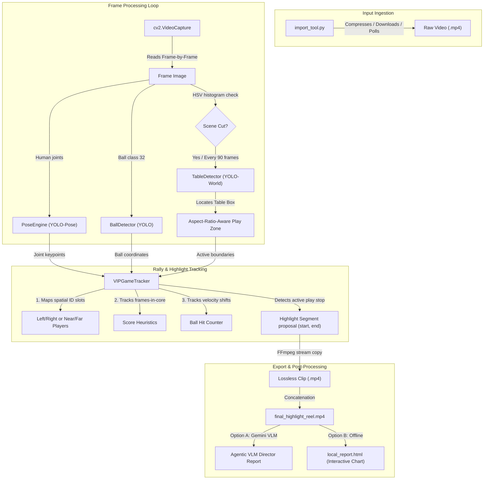

# 🏛️ TTHAC System Architecture & Design

This document details the software architecture, component design, data flow, and file layout of the Table Tennis Highlight Clipper (TTHAC) system.

---

## 🗺️ System Flow Diagram

The following diagram illustrates how video frames flow from raw inputs through detection models, state tracking, and output clipping/verification:



---

## 📂 Codebase File Layout & Component Responsibilities

```text
pingpong-auto-highlight/
├── config/
│   └── settings.py          # Centralized settings, model weights storage, and algo param defaults.
├── core/
│   ├── detectors.py         # TableDetector (YOLO-World), PoseEngine (YOLO-Pose), and BallDetector (YOLO).
│   └── tracker.py           # PlayerStats state and VIPGameTracker logic.
├── docs/
│   ├── history.md           # Timeline of commit progression and milestones.
│   └── feature_roadmap.md   # Roadmap of feature evolution stages.
├── import_tool.py          # Long video pre-compression, remote downloads, and watch folder daemon.
├── main.py                  # CLI entry point, analysis loop, scene cut detection, and report stitching.
├── tune_pipeline.py         # Closed-loop algorithm optimizer/tuner.
└── requirements.txt         # Core dependencies.
```

---

## 🛠️ Component Design Specifications

### 1. Detectors Module ([core/detectors.py](file:///home/ubuntu/projects/pingpong-auto-highlight/core/detectors.py))
Handles model weights management and wraps Ultralytics YOLO inference:
* **[TableDetector](file:///home/ubuntu/projects/pingpong-auto-highlight/core/detectors.py#L33)**: Runs YOLO-World prompts (`"ping pong table"`, `"table"`, `"tennis table"`) to detect the table coordinates. Computes the expanded play boundary.
* **[PoseEngine](file:///home/ubuntu/projects/pingpong-auto-highlight/core/detectors.py#L90)**: Tracks human pose estimation keypoints (hips, knees, ankles) to pinpoint player locations.
* **[BallDetector](file:///home/ubuntu/projects/pingpong-auto-highlight/core/detectors.py#L99)**: Filters class 32 (`sports ball`) detections to record table tennis ball trajectories.

### 2. Tracker Module ([core/tracker.py](file:///home/ubuntu/projects/pingpong-auto-highlight/core/tracker.py))
Maintains coordinate states and contains the rally detection state machine:
* **[PlayerStats](file:///home/ubuntu/projects/pingpong-auto-highlight/core/tracker.py#L4)**: Schema tracking a single player's score, frames in core zone, last seen timestamp, and VIP status.
* **[VIPGameTracker](file:///home/ubuntu/projects/pingpong-auto-highlight/core/tracker.py#L13)**:
  * Maps pose keypoints to spatial slots (`Player_Left`/`Player_Right` or `Player_Near`/`Player_Far`) to stabilize player IDs.
  * Measures VIP score based on frames spent in the core play zone.
  * Captures active play start/stops and handles short occlusions using a dropout grace period.
  * Computes ball velocity vector changes to estimate racket hits.

### 3. Pipeline Ingestion & Orchestrator ([main.py](file:///home/ubuntu/projects/pingpong-auto-highlight/main.py))
Manages video decoding, frame looping, cutting, and stitching:
* **Scene Change Monitor**: UsesHSV histogram correlations to recognize camera switches and request table re-detections.
* **FFmpeg Stream Copy**: Invokes quick, lossless video clipping using `-c copy` to avoid rendering delay.
* **VLM / Local Report Generators**: Stitch together highlights and compile traditional Chinese VLM analysis sheets or offline HTML summaries.

---

## 💾 Model Weights Registry

By default, weights are managed automatically in `storage/weights/`:

| Component | Model Filename | Task Type | Source |
| :--- | :--- | :--- | :--- |
| Table Detection | `yolov8l-worldv2.pt` | Object Detection / Open Vocabulary | Ultralytics / YOLO-World |
| Player Tracking | `yolo11l-pose.pt` | Pose Estimation (Human Keypoints) | Ultralytics / YOLO11 |
| Ball Tracking | `yolo11n.pt` | Object Detection (Class 32) | Ultralytics / YOLO11 |
