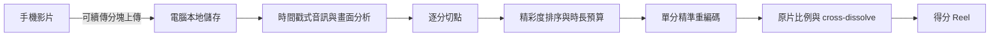

# Ping-Pong Auto Highlight

把一段完整桌球錄影，自動剪成「以得分為單位」的精彩集錦。

手機只負責錄影與上傳；電腦在本地完成影片解碼、逐分切點、精彩度排序與 Reel 剪接。原片不會送到雲端。

## 成品形式

- 預設選出最多 6 個精彩得分，而不是輸出一段長時間區間。
- 每一分保留發球前與得分後的短暫脈絡。
- 集錦預設控制在約 55 秒內。
- 預設保留原片的寬高比例、方向與畫面內容。
- 相鄰得分以 0.35 秒 cross-dissolve 連接；最後一分不做 fade-out。
- 同時保留每一分的獨立 MP4，方便人工檢查或重新排序。

直式、裁切、字幕等社群發佈格式屬於後續輸出，不會在分析階段綁死。

## Docker 常駐服務（建議）

需要先安裝並啟動 Docker Desktop。第一次設定：

```powershell
Copy-Item .env.example .env
notepad .env
docker compose up -d --build
docker compose logs -f pingpong-highlight
```

把 `.env` 裡的 `PINGPONG_PUBLIC_URL` 改成電腦目前的 Wi‑Fi IP，例如 `http://192.168.1.19:8000`。啟動後，log 會顯示完整手機網址與 QR code；`restart: unless-stopped` 會讓容器在 Docker 重新啟動後自動恢復。

上傳原片、續傳資訊、工作狀態與成品都掛載在電腦的 `./data`，重新 build 或刪除容器不會遺失。要更新程式時再執行一次：

```powershell
docker compose up -d --build
```

這份預設配置使用 CPU，任何支援 Docker 的電腦都能啟動。有 NVIDIA GPU 且 Docker GPU runtime 可用時，可以改用：

```powershell
docker compose -f compose.yaml -f compose.gpu.yaml up -d --build
```

常用管理指令：

```powershell
docker compose ps                    # 查看服務與健康狀態
docker compose logs -f pingpong-highlight
docker compose restart               # 重新啟動
docker compose down                  # 停止服務；保留 ./data
```

若希望登入 Windows 後一直可用，請同時開啟 Docker Desktop 的「Start Docker Desktop when you sign in」。

## 本機 Python 開發

需要 Python 3.11 以上、`ffmpeg` 與 `ffprobe`。

```powershell
python -m venv .venv
.\.venv\Scripts\Activate.ps1
python -m pip install -e ".[dev]"
pingpong-highlight doctor
pingpong-highlight serve
```

終端機會顯示手機網址與 QR code。手機和電腦連到同一個區域網路後，用手機開啟網址並選擇影片。上傳採用可續傳分塊；中斷後重新選擇同一檔案即可接續。

完整操作流程：

1. 電腦執行 `pingpong-highlight serve`，保持終端機與電腦開啟。
2. 手機掃描 QR code，從相簿選擇原始影片並開始傳送。
3. 上傳完成後，手機頁面可以關閉；電腦會繼續處理。
4. 回到同一網址即可直接預覽成品。
5. 使用「下載 MP4」，或在支援 Web Share 的手機使用「分享／存到相簿」。

成品也會保留在電腦的 `data/outputs/<job-id>/`。目前採用同 Wi‑Fi 的 local-first 傳輸，不需要雲端帳號、訂閱或額外上傳一次。

也可以直接分析電腦上的影片：

```powershell
pingpong-highlight analyze "D:\videos\match.mov"
```

每次工作會輸出：

- `best_points_reel.mp4`：保留原片比例的得分集錦；
- `point_###_rank_##.mp4`：各個得分片段；
- `analysis.json`：切點、排名、媒體資訊與剪接設定。

## 流程



音訊瞬變提供擊球節奏，局部畫面動態協助排除缺乏比賽活動的雜音。分析以 FFmpeg 時間戳為準，可處理手機常見的 HEVC、VFR 與 rotation metadata。輸出優先使用 NVIDIA NVENC，失敗時自動退回 `libx264`。

## 主要設定

| 環境變數 | 預設值 | 用途 |
| --- | ---: | --- |
| `PINGPONG_DATA_DIR` | `./data` | 上傳、工作狀態與輸出資料夾 |
| `PINGPONG_HOST` | `0.0.0.0` | LAN 服務位址 |
| `PINGPONG_PORT` | `8000` | LAN 服務連接埠 |
| `PINGPONG_PUBLIC_URL` | 自動偵測 | QR code 與手機要開啟的公開基底網址；Docker 建議明確設定 |
| `PINGPONG_MAX_UPLOAD_BYTES` | 100 GiB | 單檔上限 |
| `PINGPONG_VIDEO_SAMPLE_FPS` | 8 | 畫面分析取樣率 |
| `PINGPONG_MAX_POINTS` | 6 | 集錦最多收錄幾分 |
| `PINGPONG_REEL_TARGET_SECONDS` | 55 | 集錦目標長度 |
| `PINGPONG_REEL_TRANSITION_SECONDS` | 0.35 | 得分間 dissolve 長度 |

舊的 `PINGPONG_MAX_HIGHLIGHTS` 仍可作為 `PINGPONG_MAX_POINTS` 的備援值。

## 驗證

```powershell
.\.venv\Scripts\ruff.exe check .
.\.venv\Scripts\python.exe -m pytest -q
```

架構與評估方式見 [docs/architecture.md](docs/architecture.md) 與 [docs/evaluation.md](docs/evaluation.md)。
