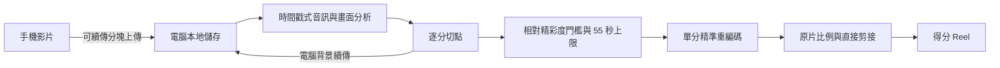

# HighlightCraft

把一段完整桌球錄影，自動剪成「以得分為單位」的精彩集錦。

手機只負責錄影與提供影片；可以直接續傳，也可以先放上 Google Drive 再貼公開連結。電腦在本地完成下載、影片解碼、逐分切點、精彩度排序與 Reel 剪接。匯入後的原片副本與成品持久儲存在這台電腦；使用 ngrok 或 Cloudflare Tunnel 時，網頁流量會經過該入口服務，而 Drive 原片由電腦直接向 Google 下載。

系統以帳號辨識影片擁有者：一般使用者只操作自己的上傳、處理紀錄、原片與成品；管理員可建立／停用試用帳號，並從管理檢視查找所有使用者的影片與結果。網址本身不再承載共用存取 token；每位試用者應使用自己的帳號登入，避免無法追溯影片來源。

目前優先完成使用者、資料歸屬、影片庫與部署可靠性，既有介面視覺暫不重做。右上角的「中 / EN」可在繁體中文與英文間切換，瀏覽器會保留選擇；登入後的頁面內也會提供使用教學。部署與維運人員請另看 [部署、備份與搬機手冊](docs/deployment.md)。

## 成品形式

- 每支影片只收錄分數至少達到該片最佳候選 87% 的得分；球數可以不同，不再為了湊滿 6 球而回填。
- 每一分預設在實際回合前後各保留 1.5 秒脈絡。
- 選片預算控制在 55 秒內；若沒有辨識到可用的得分候選，就只保留分析報告。
- 預設保留原片的寬高比例、方向與畫面內容。
- 相鄰得分直接剪接，保留桌球回合俐落、清楚的節奏。
- 同時保留每一分的獨立 MP4，方便人工檢查或重新排序。

完成影片會以精簡卡片列出，播放器、下載與分享操作預設收合；點開該支影片後才會載入集錦，避免多支成品同時佔滿頁面或消耗手機流量。重新整理後會回到全部收合的乾淨狀態。

直式、裁切、字幕等社群發佈格式屬於後續輸出，不會在分析階段綁死。

## 邀請少量試用者

1. 先以 bootstrap 管理員登入並更換初始密碼。
2. 在使用者管理為每位試用者建立一個一般帳號；不要共用管理員帳號。
3. 傳送相同的 localhost/LAN/tunnel 網址，但將每人的帳密分開、安全地交付。
4. 一般使用者登入後只會看到自己的影片庫、上傳進度、原片及剪輯成品；管理員可在全域資料管理依使用者查找與處理內容。
5. 試用結束可停用帳號，使既有 session 一併失效；資料是否刪除是另一個明確操作，不會因停用帳號自動消失。

頁面內的「使用教學」會說明上傳、Drive 匯入、等待處理、預覽與下載；維運人員的 image、`.env`、備份及搬機流程不放進一般使用教學，統一收在部署手冊。

## 只在這台電腦使用（localhost，不走 tunnel）

這是 ngrok 額度用完、公開網址失效，或只想在電腦上標記精彩球時的建議模式。若 ngrok 頁面顯示 `Network bandwidth exceeded`，不必繼續重試，直接使用本節。它不啟動 ngrok 或 Cloudflare Tunnel，網站只綁在 `127.0.0.1`，因此瀏覽器播放原片與成品不會消耗 tunnel 流量，也不會讓同一個 Wi-Fi 的其他裝置連入。

1. 開啟已更新的 Docker Desktop，確認 Docker Engine 正在執行且 `docker compose version` 至少為 v2.30.0。
2. 開啟 Git Bash，進入專案並從目前 source 建置、啟動 GPU 版本：

   ```bash
   cd /d/projects/pingpong-auto-highlight
   ./scripts/start-localhost.sh
   ```

   如果只想使用 Docker Hub 上已正式發佈、而且不需要目前 checkout 新功能的版本，才加上 `-UsePublishedImage`：

   ```bash
   ./scripts/start-localhost.sh -UsePublishedImage
   ```

   PowerShell 對應指令是：

   ```powershell
   .\scripts\start-localhost.ps1
   ```

   PowerShell 若要使用已發佈 image，對應指令是：

   ```powershell
   .\scripts\start-localhost.ps1 -UsePublishedImage
   ```

3. 等終端機顯示 `HighlightCraft localhost-only mode is ready.`，在**同一台電腦**的瀏覽器開啟它顯示的完整網址。之後也可以從 Git Bash 讀取：

   ```bash
   cat ./data/local-access-url.txt
   ```

   網址不含密碼或 token。開啟後以 HighlightCraft 帳號登入；若第一次啟動時沒有在 `.env` 指定 bootstrap 密碼，系統會把隨機管理員密碼保存在 `data/.admin-password`，啟動器只提示檔案位置、不會把密碼印到終端機。首次登入後請立即更換密碼。

啟動器會先確認目前沒有上傳、Drive 下載或剪輯正在進行，才停止 ngrok／Cloudflare Tunnel 並切換服務；若還有工作，它會拒絕重啟並告訴你先等候或刪除已放棄的未完成上傳。原片、成品、處理紀錄及人工標記都留在 `./data`，切換模式不會刪除。

預設仍使用 NVIDIA GPU。只有 NVIDIA Docker runtime 暫時不可用時，才加上 `-CpuOnly`。想確認服務及 GPU：

```powershell
docker compose -f compose.yaml -f compose.release.yaml -f compose.localhost.yaml ps
docker compose -f compose.yaml -f compose.release.yaml -f compose.localhost.yaml exec pingpong-highlight pingpong-highlight doctor
```

`pingpong-highlight` 應顯示 `healthy`，`NVIDIA NVDEC` 與 `NVIDIA NVENC` 都應顯示 `可用`。停止 localhost 服務但保留所有資料：

```powershell
docker compose -f compose.yaml -f compose.localhost.yaml stop pingpong-highlight
```

`127.0.0.1` 只能由這台電腦開啟，手機即使連同一個 Wi-Fi 也不能使用這個網址；需要同一 Wi-Fi 的手機操作時，請用後面的 LAN 模式，需要手機外網時才使用 ngrok。localhost 模式不會產生 tunnel 流量，但第一次 pull Docker image、從 source build dependencies，或讓電腦從 Google Drive 匯入影片，仍會使用一般對外網路。

## 從手機外網使用（ngrok）

只有需要從手機外網操作時才走這條流程。預設使用 ngrok，因為它的主要 tunnel 連線走 TLS 443，不像 Cloudflare Tunnel 需要目前被學校網路封鎖的 7844 連接埠。第一次使用需要免費 ngrok 帳號與 authtoken。

1. 開啟 Docker Desktop，等到左下角顯示 Docker Engine 正在執行。
2. 開啟 Git Bash，進入專案目錄：

   ```bash
   cd /d/projects/pingpong-auto-highlight
   ```

   如果之後移動了專案資料夾，請把路徑換成新的位置。

3. 第一次使用時，先在 [ngrok Dashboard](https://dashboard.ngrok.com/get-started/your-authtoken) 建立帳號並複製 authtoken。它相當於 ngrok 帳號密碼，請只貼進下一步的本機隱藏提示，不要貼到聊天、README 或公開場所。
4. 啟動剪輯服務與手機外網入口：

   ```bash
   ./scripts/start-ngrok-tunnel.sh
   ```

   第一次執行會顯示 `Paste the ngrok authtoken`；輸入內容不會顯示在畫面上，按 Enter 後會存入 Git 已忽略的 `data/.ngrok-authtoken`，之後不必重貼。腳本預設會把影片解碼與編碼交給 NVIDIA GPU，並啟動或更新 Docker 服務。若電腦暫時沒有可用的 NVIDIA Docker runtime，才改用：

   ```bash
   ./scripts/start-ngrok-tunnel.sh -CpuOnly
   ```

5. 等終端機顯示 `ngrok tunnel is ready.`，把下一行完整 HTTPS 網址傳到自己的手機並開啟。最新網址也可以隨時從電腦讀取：

   ```bash
   cat ./data/remote-access-url.txt
   ```

   免費方案第一次以瀏覽器開啟該網域時，ngrok 會先顯示防濫用提示；確認網址是自己剛產生的，再按一次 `Visit`，接著在 HighlightCraft 登入。ngrok 會為該網域保存自己的提示 cookie；HighlightCraft 的登入 session 則由系統獨立管理。

   可以把網站網址傳給受邀試用者，但每個人應使用管理員建立的獨立帳號。不要共用管理員帳密，也不要把 `.env`、`data/.admin-password` 或 ngrok authtoken 傳出去。

6. 想確認系統是否正常，可執行：

   ```powershell
   docker compose -f compose.yaml -f compose.ngrok.yaml ps
   ```

   `pingpong-highlight` 應顯示 `healthy`，`ngrok` 應顯示 `Up`。

   想確認容器內的 GPU 編解碼真的可用，而不是只有看得到顯示卡，可再執行：

   ```powershell
   docker compose exec pingpong-highlight pingpong-highlight doctor
   ```

   `NVIDIA NVDEC` 與 `NVIDIA NVENC` 都應顯示 `可用`。

使用期間請讓電腦保持喚醒，並維持 Docker Desktop 與網路連線。影片仍在上傳時，不要重啟 Docker、`ngrok` 或電腦；上傳完成後，手機頁面可以關閉，電腦會繼續分析與剪輯。

### 用 Google Drive 加入影片（大檔案建議）

這條路徑通常比手機透過公開 tunnel 把大檔案直接傳到電腦更穩定，而且貼完連結後可以立刻關閉手機頁面：

1. 在手機的 Google Drive 上傳原始影片，等 Drive 顯示上傳完成。
2. 開啟該影片的「管理存取權」或「共用」，把一般存取權改成「知道連結的任何人」，角色選「檢視者」。只要允許下載，不需要給編輯權限。
3. 複製的是單一影片連結，不是資料夾連結。
4. 在 HighlightCraft 的 Google Drive 區塊貼上連結，按「開始匯入」。
5. 「Drive 下載中」會顯示電腦端實際收到的進度；完成後會自動消失並變成 GPU 剪輯工作，不需要再按一次開始。

系統端不需要 Google 帳號、OAuth、API key 或額外設定。公開連結等同任何拿到連結的人都能讀取，因此不要用在敏感影片。等 HighlightCraft 狀態已從 Drive 下載切換成「排隊中／分析中」後，就可以把 Google Drive 共用權限改回「受限制」；電腦已下載的本機副本不受影響。

Drive 匯入的狀態與暫存檔都在 `./data`。網路中斷或服務重啟時，會保留已下載部分並在下次啟動續傳；失敗項目也可以直接在頁面重試或刪除。Google 仍可能因下載次數、擁有者禁止下載或組織政策拒絕公開下載，這時頁面會保留進度並顯示權限提示。

### 人工標記精彩球（桌面開發工具）

手機使用的上傳、處理進度、成品播放與下載都集中在頁面上方。「人工標記精彩球」是另外一個桌面限定的開發工具區塊，只列出已完成的影片，不會出現在手機版，也不屬於一般成品操作流程。

在電腦版頁面下方選擇影片並按「開啟標記」，就會進入大播放器與右側標記清單；原片到這時才會以 HTTP Range 載入，因此可以直接拖曳長影片，不必先下載整支檔案。

1. 播放或拖曳原片，在該回合實際開始的位置按 `I` 設起點。
2. 到該分結束時按 `O` 設終點，再按 `Enter` 儲存；全程不需要抄寫或輸入時間碼。
3. 選「值得收錄」；如果它是模型選到但你不喜歡的球，改選「不該收錄」。精彩標籤可以複選，例如同時選「相持」與「搶攻」；只有不在常用選項裡的內容才需要點「其他…」手動輸入，也可以完全不選。
4. `Space` 控制播放／暫停，方向鍵前後 1 秒，`Shift` 加方向鍵前後 5 秒，`Esc` 關閉工作區。標記會綁定原片與時間碼，存在 `data/state.sqlite3`，重新整理、更新容器或重跑模型都不會消失。

第一輪建議選 2–3 支不同角度、距離或光線的影片，把其中所有你會放進集錦的球標完；另留 1 支完全不參與調整，最後才用來驗證是否真的改善。先累積約 15–30 個「值得收錄」的球就足以開始比較；不必一次標完整個影片裡所有普通球。

即使頁面重新整理或公開網址改變，電腦已收到的分塊也不會遺失。請回到持有原始影片的手機，重新選擇同一支影片；只要伺服器上剛好有一筆檔名與大小相同的未完成紀錄，系統就會從保存的 offset 續傳。其他裝置可同步查看進度，但無法代替來源手機提供原始檔案。若同一影片不小心留下多筆紀錄，頁面會先要求刪除重複項目，避免再建立第四筆；「刪除這筆上傳」只會刪除電腦上的未完成分塊，不會影響手機原片。

ngrok 額度用完或公開網址失效時，請等正在進行的上傳與剪輯完成，再切回有完整本機網址與安全檢查的 localhost-only 模式：

```bash
./scripts/start-localhost.sh -UsePublishedImage
```

停止全部服務但保留 `data` 裡的原片、進度與成品：

```powershell
docker compose -f compose.yaml -f compose.ngrok.yaml stop
```

下次使用時重新執行啟動腳本即可。如果啟動失敗，先查看兩個服務的狀態與最近紀錄：

```powershell
docker compose -f compose.yaml -f compose.ngrok.yaml ps
docker compose -f compose.yaml -f compose.ngrok.yaml logs --tail 100 pingpong-highlight ngrok
```

若 ngrok 顯示 authtoken 無效，重新執行 `./scripts/start-ngrok-tunnel.sh -ReplaceAuthtoken`；若本機 4040 已被其他程式使用，改用 `./scripts/start-ngrok-tunnel.sh -InspectPort 4041`。

## Docker 常駐服務與區域網路

若只從手機外網使用，照上一節操作即可。以下設定用於同一個 Wi-Fi 的區域網路連線；需要先安裝並啟動 Docker Desktop。第一次設定：

```powershell
Copy-Item .env.example .env
notepad .env
docker compose up -d --build
docker compose logs -f pingpong-highlight
```

把 `.env` 裡的 `PINGPONG_PUBLIC_URL` 改成電腦目前的 Wi‑Fi IP，例如 `http://192.168.1.19:8000`。純 HTTP LAN 的 `PINGPONG_SESSION_COOKIE_SECURE` 必須是 `false`。啟動後，log 會顯示手機網址與 QR code；開啟後以個人帳號登入。`restart: unless-stopped` 會讓容器在 Docker 重新啟動後自動恢復。

上傳原片、Drive 下載暫存、續傳資訊、工作狀態與成品都掛載在電腦的 `./data`，重新 build 或刪除容器不會遺失。要更新程式時再執行一次：

```powershell
docker compose up -d --build
```

這份預設配置使用 NVIDIA GPU，並掛入 FFmpeg 所需的 NVDEC／NVENC driver capability。這台電腦平常直接使用：

```powershell
docker compose up -d --build
```

只有在 NVIDIA Docker runtime 暫時不可用時，才使用 CPU override：

```powershell
docker compose -f compose.yaml -f compose.cpu.yaml up -d --build
```

根目錄的 Compose 檔案是「一個基底加幾個小型開關」，不是多套不同服務。從 source 開發時只需 `docker compose up -d --build`；啟動腳本會視需要疊加 localhost、CPU、Docker Hub release、ngrok 或 Cloudflare 設定。只 pull 已發佈成品的主機則使用 `compose.deploy.yaml`。

所有管理指令都必須重複啟動時的同一組 `-f` 檔案（包括 `deploy`／`release`、`cpu` 與目前的存取模式）；只下 base-only 指令可能看不到、也停不掉仍在執行的 tunnel。例如以 pull-only ngrok 模式啟動後，應使用：

```powershell
docker compose -f compose.yaml -f compose.deploy.yaml -f compose.ngrok.yaml ps
docker compose -f compose.yaml -f compose.deploy.yaml -f compose.ngrok.yaml logs -f pingpong-highlight ngrok
docker compose -f compose.yaml -f compose.deploy.yaml -f compose.ngrok.yaml restart
docker compose -f compose.yaml -f compose.deploy.yaml -f compose.ngrok.yaml down  # 保留 data
```

若啟動時另加了 `compose.cpu.yaml`，上述每一行也要在 `compose.deploy.yaml` 後加上 `-f compose.cpu.yaml`；localhost 或 Cloudflare 模式則把最後一個 overlay 換成實際使用的檔案。從 source 啟動的純 LAN 模式只有 `compose.yaml`，那是唯一可安全使用 base-only `ps`／`down` 的情況。

若希望登入 Windows 後一直可用，請同時開啟 Docker Desktop 的「Start Docker Desktop when you sign in」。

## 在其他電腦開發，這台只部署

可以，而且這是正式使用時較建議的模式。開發電腦或 CI 負責測試、build 與 push；這台有 GPU／大容量磁碟的電腦只需要 Docker、Compose 部署 bundle、自己的 `.env` 與持久 `data`。不需要複製 `.venv`、Python dependencies、Git 工作樹或開發機的 `.env`。

部署端先從 `.env.example` 建立新的 `.env`，把 `PINGPONG_IMAGE` 固定到發佈後的 tag，最好是 `image@sha256:...` digest，再執行：

```powershell
docker compose -f compose.yaml -f compose.deploy.yaml pull
docker compose -f compose.yaml -f compose.deploy.yaml up -d --wait
```

`compose.deploy.yaml` 明確移除本地 build，且會把 `PINGPONG_DATA_PATH` 掛到 `/data`；容器更新不會帶走使用者、影片、成品或標記。`.env` 不進 Git/image，bootstrap admin 密碼也不得提交。完整的首次部署、HTTPS cookie、備份、升級、rollback 與換機步驟見 [docs/deployment.md](docs/deployment.md)。

## 影片播放效能

`localhost` 只表示瀏覽器與服務在同一台電腦，不代表影片不需要經過 HTTP、Docker bind mount 與瀏覽器解碼。影片端點使用可感知斷線的 HTTP Range 串流與較大的讀取區塊；播放器收合或拖曳造成舊請求中斷時，伺服器會立即停止讀檔，不會在背景繼續把整支原片讀完。多人共用瀏覽器時為避免上一個帳號的影片留在 HTTP cache，原片與成品使用 `no-store`；同一段播放中的拖曳仍由 Range request 讀取需要的區段。

新產生的 H.264 成品最多使用 30 fps、約兩秒一個 GOP，並限制目標與峰值碼率。1.2.3 以前已完成的 MP4 不會被自動覆寫；它們仍可透過新版串流順暢播放，但若希望把舊的 120 fps／高碼率檔案縮小，需要重新處理原片。

正式提供多人或外網使用時，不應讓免費 tunnel 兼任大量影片配送。建議讓 HighlightCraft 保留驗證、工作狀態與剪輯 API，把完成影片交給支援 Range／sendfile 的反向代理，或使用有權限控制的 object storage／CDN；這樣同時改善並行播放、流量成本與跨地區延遲。

## 在 4090／其他 NVIDIA 電腦使用已發佈 image

目前 Docker Hub 已發佈版仍是 `1.3.0`；此分支的候選 image 是 `docker.io/momonong/pingpong-auto-highlight:1.4.0`，需完成驗收並正式發佈後才可在部署機 pull。RTX 5090 Laptop 與 RTX 4090 Desktop 都使用同一個 `linux/amd64` image；image 不包含 NVIDIA driver，啟動時由主機的 NVIDIA Container Toolkit 提供 NVDEC／NVENC 所需元件，因此不要建立 `5090` 或 `4090` 專用 tag。

新電腦需要先安裝並啟動 Docker Desktop、使用 Linux containers，並讓 Docker 能存取 NVIDIA GPU。開發用途可取得完整 repository 後用啟動器；正式執行主機只需上一節所列的 Compose 部署 bundle。完整 repository 的 Git Bash 快速啟動方式是：

```bash
cd /d/projects/pingpong-auto-highlight
./scripts/start-ngrok-tunnel.sh -UsePublishedImage
```

這個選項會直接 pull 版本固定的 public image，不會在新電腦重新 build。只在 GPU runtime 暫時不可用、確定願意接受較慢速度時，才同時加上 `-CpuOnly`。

若只需要區域網路、不啟動 ngrok：

```powershell
docker compose -f compose.yaml -f compose.release.yaml up -d
docker compose -f compose.yaml -f compose.release.yaml exec pingpong-highlight pingpong-highlight doctor
```

`doctor` 的 `NVIDIA NVDEC` 與 `NVIDIA NVENC` 都必須顯示 `可用`。目前 5090 Laptop 已實測通過；4090 移機後仍應用同一支測試影片做一次驗收，比較選出的得分時間點、成品長度與是否可播放，不要比較 MP4 檔案 hash，因為不同 GPU／driver 的硬體編碼結果不保證逐 bit 相同。

正式使用請固定版本 tag，最好固定 `data/published-image.txt` 記錄的 digest；`latest` 只供方便查看最新版本，不應作為長期部署鎖定值。所有使用者資料、原片、續傳與成品仍在該電腦的 `./data`，不會存進 Docker Hub image。

### 發佈新版本到 Docker Hub

只有在變更已提交、合併到乾淨的 `main`，且 Docker Desktop 已登入 `momonong` 時才執行：

```bash
./scripts/publish-dockerhub.sh
```

發佈器固定產生 `linux/amd64`，使用 `pyproject.toml` 的版本建立 version tag 與 `latest`，附加 SBOM／provenance，確認 repository 是 public，再從 Docker Hub pull 回來檢查版本與 NVIDIA NVDEC／NVENC。Python base image、production dependencies 與 build dependencies 都以 digest 或 hashes 固定；`data`、`.env`、影片及 secret 由 `.dockerignore` 排除。部署時仍應使用 registry 回傳的 manifest digest，因為 registry tag 技術上可以被重新指向。

## ngrok Tunnel 細節

Git Bash 的標準啟動指令：

```bash
./scripts/start-ngrok-tunnel.sh
```

若手機第一次開啟時先看到 ngrok 的「Visit Site」頁面，按下後會進入 HighlightCraft 登入頁。這兩層 cookie 不同：前者只記住 ngrok 防濫用提示，後者是 HighlightCraft 的 HttpOnly 登入 session。重新整理或網址改變不會刪除電腦 `data` 裡的影片與成品；新 tunnel 網域會需要重新登入。

PowerShell 也可以使用同一套流程：

```powershell
.\scripts\start-ngrok-tunnel.ps1
```

啟動器會確認 Docker，並在任何可能重建 HighlightCraft container 的步驟前確認所有使用者都沒有未完成上傳、Drive 匯入或剪輯。它接著啟動預設 GPU 服務與 ngrok、等待公開 health check 通過，再停止仍在執行的 Cloudflare Tunnel 並顯示 HTTPS 網址；若新入口失敗，既有 Cloudflare 入口不會被提前關閉。ngrok 的 HTTP 請求檢視預設關閉，避免在本機 Traffic Inspector 保存影片與 API 要求；4040 只綁在 `127.0.0.1`，啟動器用它讀取 tunnel 網址，不會對區域網路公開。

免費方案會提供一個開發用網域，而且 endpoint 沒有固定逾時，但目前每月包含 1 GB 對外傳輸與 20,000 個 HTTP requests。把原片先傳到 Google Drive、再讓電腦直接下載，不會讓整支原片經過 ngrok；手機直接上傳與下載完成的集錦則會使用 ngrok 額度。額度可能調整，實際數字以 [ngrok Free plan limits](https://ngrok.com/docs/pricing-limits/free-plan-limits) 為準。

只停止 ngrok、保留本機剪輯服務與資料：

```powershell
docker compose -f compose.yaml -f compose.ngrok.yaml stop ngrok
```

要讓新的 ngrok authtoken 取代本機保存的舊值：

```bash
./scripts/start-ngrok-tunnel.sh -ReplaceAuthtoken
```

## Cloudflare Quick Tunnel 細節（備用）

不需要 Cloudflare 帳號或網域。Docker Desktop 啟動後，在專案目錄執行。Git Bash：

```bash
./scripts/start-cloudflare-tunnel.sh
```

PowerShell 也可以使用同一套流程：

```powershell
.\scripts\start-cloudflare-tunnel.ps1
```

若這台只負責執行已發佈 image，可加上 `-UsePublishedImage`，避免從 source build：

```powershell
.\scripts\start-cloudflare-tunnel.ps1 -UsePublishedImage
```

腳本會在任何可能重建 HighlightCraft container 的步驟前確認全域沒有進行中的工作，再啟動本機服務、保留健康的既有 Cloudflare tunnel，並在失效時自動建立新的臨時 HTTPS 網址。公開 health check 通過後，它才停止仍在執行的 ngrok 並顯示登入網址；若新入口失敗，既有 ngrok 不會被提前關閉。可以把網址傳給受邀試用者，但請為每人建立獨立帳號；不要共用管理員密碼。

這台電腦與 Docker Desktop 必須保持開啟。Quick Tunnel 是測試用途，沒有固定網址或 uptime SLA；`cloudflared` 容器重建後需重新執行腳本並使用新網址。最新網址也會保存在本機的 `data/remote-access-url.txt`。新網址仍可藉由檔名與檔案大小接回唯一一筆未完成上傳；若之後要固定書籤或避免網址變動，再改用 Cloudflare named tunnel。

這台電腦沒有可用的 NVIDIA Docker runtime 時，才改用 CPU 模式：

```bash
./scripts/start-cloudflare-tunnel.sh -CpuOnly
```

PowerShell：

```powershell
.\scripts\start-cloudflare-tunnel.ps1 -CpuOnly
```

只停止外網入口、保留本機剪輯服務與資料：

```powershell
docker compose -f compose.yaml -f compose.cloudflare.yaml stop cloudflared
```

如果紀錄出現 `CONNECTIVITY PRE-CHECKS`、`QUIC connection failed`，並同時顯示 TCP 與 UDP 失敗，代表目前網路封鎖 Cloudflare Tunnel 對外使用的 `7844` 連接埠；一直重啟不會解決。請改用上方 ngrok，或讓電腦改連家中網路／手機熱點後再重試。公司或學校網路則需要網路管理員允許對外 TCP 或 UDP `7844`。詳情見 [Cloudflare connectivity pre-checks](https://developers.cloudflare.com/cloudflare-one/networks/connectors/cloudflare-tunnel/troubleshoot-tunnels/connectivity-prechecks/)。

## 本機 Python 開發

需要 Python 3.11 以上、`ffmpeg` 與 `ffprobe`。

```powershell
python -m venv .venv
.\.venv\Scripts\Activate.ps1
python -m pip install -e ".[dev]"
pingpong-highlight doctor
pingpong-highlight serve
```

終端機會顯示手機網址與 QR code。手機和電腦連到同一個區域網路後，用手機開啟網址並選擇影片。上傳採用可續傳分塊；中斷後重新選擇同一檔案即可接續。

上傳百分比以電腦實際保存的分塊為準；登入後可在手機或電腦查看自己帳號的進度。重新整理不會遺失已傳資料，但瀏覽器基於安全限制不會自動恢復手機相簿裡的檔案；請在原來源裝置重新選擇同一支影片。系統會先使用該帳號保存的工作階段；若網址已改變，則以同一使用者下完全相同的檔名與檔案大小接回唯一的未完成紀錄。其他裝置能監看，無法代替來源裝置送出它沒有的原始檔案。

完整操作流程：

1. 電腦執行 `pingpong-highlight serve`，保持終端機與電腦開啟。
2. 手機掃描 QR code，從相簿選擇原始影片，或貼上公開 Google Drive 影片連結。
3. 手機直傳需等上傳完成才能關頁；Drive 連結送出後即可關頁，電腦會在背景下載並處理。
4. 回到同一網址即可直接預覽成品。
5. 使用「下載 MP4」，或在支援 Web Share 的手機使用「分享／存到相簿」。

成品也會保留在電腦的 `data/outputs/<job-id>/`。LAN 模式不需要雲端帳號或訂閱；Quick Tunnel 模式的傳輸會經過 Cloudflare，但分析、剪輯與持久儲存仍只在這台電腦進行。

也可以直接分析電腦上的影片：

```powershell
pingpong-highlight analyze "D:\videos\match.mov"
```

每次工作會輸出：

- `best_points_reel.mp4`：保留原片比例的得分集錦；
- `point_###_rank_##.mp4`：各個得分片段；
- `analysis.json`：所有候選、入選／淘汰原因、有效門檻、切點、排名、媒體資訊與剪接設定。

## 流程



音訊瞬變提供擊球節奏，局部畫面動態協助排除缺乏比賽活動的雜音。分析以 FFmpeg 時間戳為準，可處理手機常見的 HEVC、VFR 與 rotation metadata。預設容器使用 NVIDIA NVDEC 解碼、NVENC 編碼；不相容的影片或 GPU runtime 失效時會自動退回 CPU／`libx264`。音訊分析、NumPy 訊號計算與部分 FFmpeg filters 仍會使用 CPU，因此 CPU 用量不會完全歸零。

## 主要設定

| 環境變數 | 預設值 | 用途 |
| --- | ---: | --- |
| `PINGPONG_DATA_DIR` | `./data` | 上傳、工作狀態與輸出資料夾 |
| `PINGPONG_HOST` | `0.0.0.0` | LAN 服務位址 |
| `PINGPONG_PORT` | `8000` | LAN 服務連接埠 |
| `PINGPONG_PUBLIC_URL` | 自動偵測 | QR code 與手機要開啟的公開基底網址；Docker 建議明確設定 |
| `PINGPONG_BOOTSTRAP_ADMIN_USERNAME` | `admin` | 空資料庫第一次啟動時建立的管理員名稱 |
| `PINGPONG_BOOTSTRAP_ADMIN_PASSWORD` | 自動產生 | 首次 bootstrap secret；留空時寫入 `data/.admin-password`，不可提交 |
| `PINGPONG_SESSION_TTL_SECONDS` | `604800` | 登入 session 有效秒數（預設 7 天） |
| `PINGPONG_SESSION_COOKIE_SECURE` | `false` | HTTPS 外網設 `true`；HTTP localhost/LAN 保持 `false` |
| `PINGPONG_IMAGE` | deploy 必填 | `compose.deploy.yaml` 使用的固定 tag／digest |
| `PINGPONG_DATA_PATH` | `./data` | `compose.deploy.yaml` 在主機上的持久資料路徑 |
| `PINGPONG_MAX_UPLOAD_BYTES` | 100 GiB | 單檔上限 |
| `PINGPONG_DOWNLOAD_MIN_FREE_BYTES` | 2 GiB | Drive 匯入時保留的最低可用空間 |
| `PINGPONG_VIDEO_SAMPLE_FPS` | 8 | 畫面分析取樣率 |
| `PINGPONG_MIN_POINT_SCORE_RATIO` | 0.87 | 候選至少需達到同片最佳分數的比例；目前是 heuristic 的暫定值，不是機率 |
| `PINGPONG_MAX_POINTS` | 0 | 選用的球數安全上限；`0` 表示不限制 |
| `PINGPONG_REEL_TARGET_SECONDS` | 55 | 單支集錦的選片秒數預算（保留舊變數名稱） |
| `PINGPONG_CLIP_PRE_ROLL_SECONDS` | 1.5 | 每球在實際回合前保留的秒數 |
| `PINGPONG_CLIP_POST_ROLL_SECONDS` | 1.5 | 每球在實際回合後保留的秒數 |

選球順序是先套精彩度門檻，再依分數由高到低放入 55 秒預算；不會為了達到最低球數而回填。舊的 `PINGPONG_MAX_HIGHLIGHTS` 仍可作為 `PINGPONG_MAX_POINTS` 的備援值。若既有 `.env` 寫了 `PINGPONG_MAX_POINTS=6`，它會繼續作為明確的安全上限；改成 `0` 才是新版預設的不限制球數。

相對門檻可適應不同球館、收音與鏡位造成的分數尺度差異，但只要偵測到候選，就一定會保留該片最高分的一球。要可靠判斷「整支影片都不夠精彩」並輸出零球，仍需先補齊明確的負向標記，再把 heuristic 分數換成校準過的模型機率。

## GPU 訓練環境（uv）

訓練套件放在獨立的 `train` dependency group，不會增加一般網站服務的安裝內容。Windows／Linux 使用已鎖定的 PyTorch CUDA 13.0 wheel：

```powershell
uv sync --frozen --group train
uv run --frozen --group train python -c "import torch; assert torch.cuda.is_available(); print(torch.__version__, torch.version.cuda, torch.cuda.get_device_name(0))"
```

需要同時執行測試時再加上開發套件：`uv sync --frozen --group train --extra dev`。這只準備並驗證 GPU 執行環境；正式訓練仍應等 candidate 資料與正／負標註檢查完成後，再由固定的 training entrypoint 啟動。

## 驗證

```powershell
.\.venv\Scripts\ruff.exe check .
.\.venv\Scripts\python.exe -m pytest -q
```

架構與評估方式見 [docs/architecture.md](docs/architecture.md) 與 [docs/evaluation.md](docs/evaluation.md)；production 操作見 [docs/deployment.md](docs/deployment.md)。
