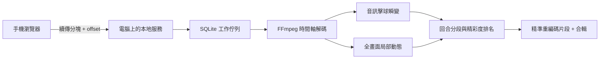

# Ping-Pong Auto Highlight

把手機錄下的整場桌球影片直接傳到自己的電腦，由電腦找出候選精彩回合並輸出個別片段與精華合輯。影片不經第三方雲端。

這個版本是重新整理過的 local-first MVP。它不再假設球桌位於畫面中央，也不靠「某個人一直站在桌邊」判定回合；分析會融合連續擊球的音訊瞬變與畫面中的局部動態。手機的 HEVC、可變幀率與旋轉 metadata 統一交給 FFmpeg 的時間軸處理。

## 快速開始

需求：Python 3.11 以上、`ffmpeg` 與 `ffprobe`。Windows 可從 [FFmpeg 官方下載頁](https://ffmpeg.org/download.html)選擇 build。

```powershell
python -m venv .venv
.\.venv\Scripts\Activate.ps1
python -m pip install -e ".[dev]"
pingpong-highlight doctor
pingpong-highlight serve
```

終端機會顯示手機網址與 QR code。讓手機和電腦連上同一個 Wi-Fi，掃碼後從相簿選影片即可。Windows 第一次啟動時，防火牆請只允許「私人網路」。

若影片已經在電腦上，也可以直接執行：

```powershell
pingpong-highlight analyze "D:\videos\match.mov"
```

輸出預設放在 `data/outputs/`；上傳原片、SQLite 工作狀態與中間資料都在 `data/`，此目錄不會進 Git。

## 為什麼重做

舊原型只掃描開頭 90 幀找一次球桌，再將「長時間出現在球桌區域的人」當成 rally。這會把等待、撿球和聊天一起剪進來，而且攝影角度一換就失效。它也用 OpenCV 的 frame index 讀手機原檔，再以 stream copy 剪片；對可變幀率、旋轉與非關鍵幀切點都不可靠。

新資料流如下：



- 上傳使用 tus 1.0 的核心語意：建立 upload resource、查詢 server offset、`PATCH` 分塊續傳，以及可用時的 SHA-256 chunk checksum。頁面重新開啟後，重新選同一個檔案即可從電腦已收到的位置繼續。
- 工作狀態持久化在 SQLite。服務重啟後，未完成分析會重新排隊；為避免同一張 GPU 同時跑多份影片，預設只有一個分析 worker。
- FFmpeg 直接產生固定時間取樣的單色小畫面與單聲道音訊，不依賴原片 frame index。分析不需要 OpenCV 或大型 YOLO 權重。
- 精華輸出會重新編碼，確保切點準確；偵測到 NVIDIA NVENC 時優先走 GPU，否則自動回退 `libx264`。

完整設計與後續模型策略見 [docs/architecture.md](docs/architecture.md) 與 [docs/evaluation.md](docs/evaluation.md)；舊原型到這次重做的取捨記錄在 [docs/history.md](docs/history.md)。

## 常用設定

以下都可用環境變數覆寫：

| 變數 | 預設 | 用途 |
| --- | ---: | --- |
| `PINGPONG_DATA_DIR` | `./data` | 原片、狀態與輸出位置 |
| `PINGPONG_HOST` | `0.0.0.0` | LAN 監聽位址 |
| `PINGPONG_PORT` | `8000` | 服務 port |
| `PINGPONG_UPLOAD_TOKEN` | 首次啟動自動建立 | 手機上傳權限 |
| `PINGPONG_MAX_UPLOAD_BYTES` | 100 GiB | 單檔上限 |
| `PINGPONG_VIDEO_SAMPLE_FPS` | 8 | 畫面分析取樣率 |
| `PINGPONG_MAX_HIGHLIGHTS` | 12 | 每支影片最多輸出段數 |

`data/.upload-token` 是區域網路存取密鑰，請勿分享。這個 MVP 適合可信任的家用 LAN；若要跨網路使用，應加 HTTPS／VPN，並以正式的 tus server、使用者驗證和物件儲存取代內建單機 upload store。

## 目前限制

這一版建立的是可用、可測量的 baseline，不是假裝已經解決所有鏡位：

- 很吵的球館、背景音樂、拍手或附近球桌，可能產生假的擊球瞬變。
- 手持移動鏡頭會降低畫面動態訊號的可信度；固定手機效果最好。
- 沒有音軌時會退回純畫面動態，精準度通常較低。
- 「精彩」目前以擊球數、節奏、持續時間與球員動態排名，還不知道你個人的偏好。

下一步不應繼續盲調 threshold，而是用你實際拍攝的不同角度影片建立小型標註集，依 precision／recall 與時間邊界誤差迭代。評估流程已在文件中定義，之後才能有根據地加入桌球專用聲音分類器、球員／球桌定位或時序模型。

## 開發

```powershell
python -m pip install -e ".[dev]"
ruff check .
pytest
```
