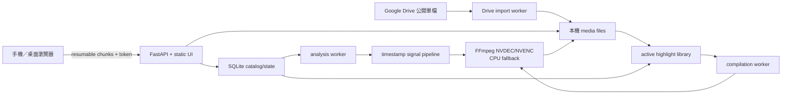
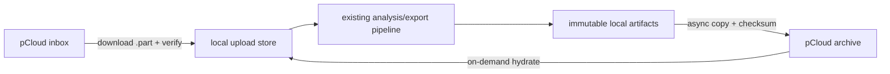

# Architecture

## Design goals

1. 手機只負責錄影與選檔，耗電的解碼、推論和編碼全部留在電腦。
2. 影片可以很長，網路中斷不必重傳，服務重啟不遺失工作狀態。
3. 分析以時間戳而非 frame number 為真實來源，正常處理手機常見的 HEVC、VFR 與 rotation metadata。
4. 第一個 baseline 不依賴固定鏡位、球桌方框或數 GB 模型權重。
5. 每次結果留下可比較的 `analysis.json`，後續模型迭代能量化，而不是憑感覺調參數。
6. 產品輸出以一個 scored point 為可重用素材單位；來源影片、素材與自訂集錦是分離的多階段關係。

## System overview

系統分成三層：FastAPI/UI 是 control plane，SQLite 是 metadata catalog 與狀態機，`data/` 裡的實體影片是 media plane。三個背景 manager 分別處理 Drive 匯入、來源分析及 compilation；分析、CLI rebuild 與 compilation 會共用同一個媒體鎖，Drive 下載則可並行。

## Components

### Mobile upload UI

`src/pingpong_highlight/static/` 是無 build step 的 mobile-first 頁面。它把影片切成 8 MiB blob，依序 `PATCH` 到 upload resource。每次 request 都帶 server offset；request 或 response 中斷時，client 先用 `HEAD` 查詢電腦實際收到的位置，再決定是否重送。瀏覽器允許 Web Crypto 時，另帶 SHA-256 checksum。

瀏覽器不允許頁面在背景永久執行，因此 iOS 把 Safari 完全關掉時上傳仍會停下；但 partial file 和 offset 會保留。重新開頁、再選同一個原檔即可續傳。

`GET /api/uploads` 會回傳尚未完成的 upload offset、總大小與最後更新時間。前端把它和 `/api/jobs` 組成一致的活動視圖，因此重新整理或換到另一台已授權裝置仍能監看伺服器實際收到的百分比。另一台裝置沒有手機相簿裡的 `File` bytes，只能監看；續傳仍由來源裝置重新選擇同一原檔後執行。

### Upload store and state

- `uploads.py` 只用隨機 ID 當磁碟檔名，原始 filename 僅作 metadata，避免 path traversal。
- chunk 先寫獨立暫存檔並驗證 checksum，再 append 到 `.part`。完整收到後才以 atomic rename 變成分析輸入。
- `db.py` 以 SQLite WAL 保存 upload offset、job 狀態、highlight clip 的 metadata／相對路徑、ordered compilation items、進度與結果；SQLite 不保存 MP4 bytes。
- `jobs.py` 預設單 worker；來源分析與 compilation builder 另共用同一把 media work lock，避免同時搶 GPU／磁碟頻寬。重啟時會把中斷工作重新排隊。

目前內建 store 以單一 uvicorn process 為假設。若公開部署或多機擴充，API contract 可保留，傳輸層改接官方 `tusd`，輸入放 S3-compatible object storage，工作佇列改用 Redis／Postgres。

### Persistence boundary

Docker Compose 把主機的 `./data` bind mount 到容器 `/data`。資料庫與媒體檔是同一份邏輯資料集，但職責不同：

| 類型 | 位置 | 權威內容 |
|---|---|---|
| catalog/state | `data/state.sqlite3` | ID、關聯、狀態、offset、分數、active 版本、人工標記、排列順序 |
| 原片 | `data/uploads/` | 完成匯入、可供重建與人工標記的來源 bytes |
| 來源素材 | `data/outputs/<job-id>/` | `analysis.json`、逐球 MP4、版本化 `clip-sets/` |
| 最後集錦 | `data/compilations/<compilation-id>/` | 使用者提交排序後產生的 H.264/AAC MP4 |

`uploads` 與 `jobs` 是最多一對一；一個 upload 可有多個 `annotations` 和 `highlight_clips`；一個 compilation 透過有 `position` 的 `compilation_items` 對多個 clips 建立有序多對多關係。系統目前沒有獨立 `clip_sets` table，版本是由每筆 `highlight_clips.library_version` 與 `active` 表達。

`jobs.result_json` 保存初次分析的工作結果；每次分析本身另有磁碟上的 `analysis.json`。`rebuild-library` 不覆寫原 job 結果，而是在獨立的 `clip-sets/<algorithm-version>-<timestamp>/` 寫完所有檔案後，以單一 SQLite transaction 停用舊 clip rows、啟用新 rows。DB 的 `library_version` 只保存演算法版本，不含 timestamp。舊 rows 與舊 MP4 保留，因此 DB activation 是 atomic，但檔案系統不是單一 transaction；中斷可能留下未被 DB 引用的半成品目錄，不會取代現役版本。

詳細目錄樹、資料表與備份／保留策略見 [storage.md](storage.md)。

### Google Drive import

`drive.py` 只接受明確的 HTTPS Google Drive 單檔網址，解析並保存 file ID，不會把使用者輸入當作任意下載網址，以避免 SSRF。公開影片由獨立的單 worker 背景下載器寫入 `data/drive-imports`；SQLite 保存 queued、resolving、downloading、failed 與 completed 狀態。下載完成後，檔案以 atomic rename 移入 upload store，並在同一個資料庫 transaction 建立既有 job，因此後續一律走相同的 GPU 優先分析與輸出流程。

下載器會保留 `.part`、回報電腦端 offset、限制單檔大小並預留磁碟空間。服務重啟會把中斷中的匯入重新排隊，再從磁碟上的部分檔案續傳。這條公開連結模式不需要 OAuth，但可讀權限由 Google Drive 連結本身承擔；多人或敏感資料版本應改成 OAuth service account／使用者授權，而不是擴大這個 bearer-link 模式。

### Planned pCloud archive adapter

pCloud 的角色是 durable archive 與可選 inbox，不是 live filesystem。現行分析 contract 繼續要求一個完整、已驗證的本機 `source_path`，因此未來 pCloud adapter 只在 pipeline 兩側工作：

第一階段使用 rclone 原生 pCloud backend 與 OAuth，archive worker 不拿 GPU media lock，但應限制網路／磁碟並行度。它只做單向 immutable copy；上傳、provider checksum 與 DB commit 全部成功後才標成 remote verified。第二階段才新增 `storage_objects` catalog、inbox 掃描、local eviction 與 on-demand hydration。`rclone.conf`／OAuth token 要留在 runtime media mount 之外並限制權限。

live SQLite、FFmpeg seek input 與未完成 `.part` 都不能直接放在 pCloud Drive、WebDAV 或 rclone mount。這能讓雲端斷線只延遲 archive，不會破壞處理中的 transaction。完整資料生命週期與官方能力連結見 [storage.md](storage.md#pcloud-長期保存方案規劃中尚未實作)。

### Timestamp-based media layer

`pipeline/media.py` 用 `ffprobe` 取得 duration、codec、audio stream 與 rotation，再啟動兩條 FFmpeg decode pipe：

- audio：16 kHz mono float PCM；
- video：8 fps、320 × 320 letterboxed grayscale raw frames。

Docker 預設掛入 NVIDIA 的 `compute,utility,video` capabilities。NVDEC runtime 可用時，video pipe 以 CUDA 硬體解碼並把畫面傳回系統記憶體，再由 FFmpeg filters 縮小成分析尺寸；不支援的 codec／pixel format 或 GPU 錯誤會自動重新以軟體解碼。FFmpeg 預設會在 filter stage 套用 rotation metadata。固定 fps filter 讓第 `n` 個分析畫面對應 `n / analysis_fps`，不會沿用不可靠的原片 frame count。固定尺寸只供訊號分析，最終輸出仍從原片重編碼。縮放、灰階 motion 與 NumPy 訊號計算仍在 CPU 執行。

### Signal fusion baseline

音訊每 16 ms 計算一次短時頻譜，組合正向 spectral flux、高頻能量與 RMS transient，再以每分鐘 contextual median／MAD 正規化。non-maximum suppression 把局部峰值轉成 impact events。

畫面訊號計算相鄰 sample 的灰階差，切成 8 × 8 blocks。只聚合變化最大的八分之一區塊，並扣除全畫面背景變化，因此不必知道球桌在哪裡。曝光突變或 scene cut 影響大多數 blocks，會被抑制。

相鄰 impact events 依合理回球間隔組成 point candidate；impact count、tempo、節奏一致性、span 與局部 motion 共同形成 ranking score。沒有可靠 audio candidate 時才使用 motion-only fallback。

point candidate 不會再彼此合併。系統以同片最佳分數為基準，預設把達 70% 的候選各自存入素材庫；87% 只標成推薦。資料庫保存 `relative_score`，API 依目前設定動態計算 `recommended`，不是在 clip row 存一個永久 boolean。來源擷取不再套 Reel 秒數預算，預設也不設固定球數，`max_points` 僅保留為選用安全上限。相鄰的已保存得分若 padding 重疊，兩者會平分中間的安靜區域，避免下一次發球或上一分反應同時出現在兩個片段。素材依原片時間輸出，rank 仍表示該來源內的分數順序。

目前相對分數是 heuristic，不是跨來源校準過的精彩機率。`analysis.json` 會保存所有候選的核心區間、分數、素材門檻、推薦門檻，以及 `selected`、`below-score-threshold`、`point-cap` 決策，供後續以完整正／負標記校準。

### Export

舊版的 `-c copy` 只能在 keyframe 附近切割。現在每個 point 都經 accurate seek 後重編碼成 H.264/AAC，加 `faststart` 方便手機播放。GPU runtime 可用時，輸入優先經 NVDEC 解碼並以 NVENC 編碼；能力檢查會實際試編一個 frame，避免只因 FFmpeg 列出 `h264_nvenc` 就誤判。任何 GPU 編解碼失敗仍會用 CPU／`libx264` 重試。

`build_point_reel()` 只在使用者提交 ordered compilation items 後執行。它以第一個素材的解析度、畫面比例與 FPS 作為成品規格，將不同來源的影音 stream 正規化後，以 FFmpeg `concat` filter 重新編碼成 hard cuts；比例不同的來源會 letterbox。缺音軌的單一素材會補等長靜音，不會讓整支跨來源集錦失去聲音。輸出不設預設時長上限。網站分析、背景集錦與 CLI 重建會透過 data directory 內的跨程序 lock file 共用同一個 GPU media slot。直式、裁切與字幕屬於後續發佈衍生版本。

`highlight_clips` 保存穩定 clip ID、來源時間、來源內分數與 active library version。舊版結果可回填，但未曾輸出的舊候選必須明確重跑；新版 clip set 全部成功後才切換 active，舊檔不刪除。集錦 builder 的未送出勾選只存在瀏覽器記憶體；`POST /api/compilations` 成功後，`compilations` 與 `compilation_items` 才保存跨來源選取及明確順序，背景 manager 再建立 H.264/AAC 成品。所有素材與集錦端點都受 token 保護並支援 HTTP Range。

### Media delivery and trust boundary

原片、逐球素材、舊 job 輸出與 compilation 都由受 upload token 保護的 API 提供。API 不接受任意磁碟路徑，而是先從 SQLite 取得相對路徑，再確認解析後仍位於該 job 或 compilation 的允許目錄內。影片端點支援單一 byte range、`206 Partial Content`、`ETag`、`Last-Modified` 與 `If-Range`；瀏覽器拖曳時可只讀需要的範圍，`download=true` 才切換成附件下載。

目前 token 是單一使用者 bearer secret，適合這個 local-first side project，不等於多使用者授權模型。`data/.upload-token`、帶 token 的 local/remote URL 與 ngrok authtoken 都不能公開。公開部署時還需要 TLS、使用者身分、每個資源的 authorization、rate limiting 與反向代理／object storage 的媒體配送策略。

## Failure and recovery model

| Failure | Recovery |
| --- | --- |
| 手機 Wi-Fi 短暫中斷 | client `HEAD` offset 後重試 |
| 手機關頁 | 重新選同一檔案後續傳 |
| chunk 損毀 | checksum mismatch，不推進 offset |
| 服務在上傳途中停止 | `.part` 大小與 SQLite offset 在啟動時 reconcile |
| Drive 下載中斷或服務停止 | 保留 `.part`，頁面重試或下次啟動後續傳 |
| Drive 權限或下載政策拒絕 | 匯入標記失敗，修正共用權限後從頁面重試 |
| 服務在分析途中停止 | job 重新排隊並從頭分析；不會重傳原片 |
| 服務在 compilation 途中停止 | processing 工作改回 queued，重新建立同一輸出 |
| NVDEC 不可用或不支援來源格式 | 同一支影片自動改用 CPU 解碼 |
| NVENC 不可用 | 同一 clip 自動改用 `libx264` |
| Compilation filter 或編碼失敗 | 素材不受影響，工作標記 failed 並保留錯誤 |
| 無音軌 | motion-only fallback，報告會標記 |
| active MP4 被手動刪除 | SQLite 索引仍在；播放回傳 404，使用它的 compilation 失敗 |
| SQLite 遺失 | 影片 bytes 還在，但狀態、標註、active 版本與順序無法只靠檔名完整還原 |

## Intentional non-goals for this baseline

- 不追蹤 3 px 寬且常 motion-blur 的球；沒有專用訓練資料時，generic object detector 對此不可靠。
- 不把 generic pose ID 當 rally state；人站在畫面裡不代表正在打球。
- 不建立雲端物件儲存、付款流程或多人帳號系統。Quick Tunnel 只負責傳輸，影片分析與持久儲存仍是單機 local-first。
- 不提供已完成來源、clip-set 或 compilation 的自動 retention／garbage collection；現階段以保留與可回溯為優先。
