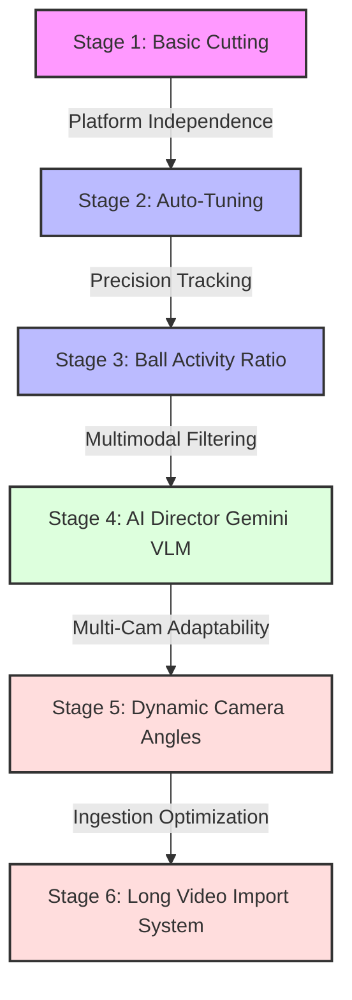

# 🗺️ TTHAC Feature Roadmap & Evolution Path

This document outlines the architectural evolution of the Table Tennis Highlight Clipper (TTHAC), showing the progression of features from basic video cutting to a production-ready, agent-friendly, multimodal sports analysis workstation.

---

## 🏔️ Feature Evolution Graph

---

## ⚙️ Evolution Details & Architectural Milestones

### 🎥 Stage 1: Computer Vision Core (Feb 2026)
* **Status**: Legacy (Core Foundation)
* **Goal**: Basic extraction of clips containing active players.
* **Technology**:
  * **YOLO-World** (table zone isolation).
  * **YOLO-Pose** (player coordinate tracking).
* **Limitation**: Highly sensitive to parameter setup. Hardcoded paths broke execution across different developer environments.

### 📈 Stage 2: Cross-Platform Compliance & Auto-Tuning (Jun 2026)
* **Status**: Production-Ready
* **Goal**: Parameter optimization and platform robustness.
* **Technology**:
  * Dynamic relative paths via standard `pathlib` mappings under `./storage/`.
  * Feedback tuning engine (`tune_pipeline.py`) that monitors clip counts and loops parameter adjustment automatically.
* **Limitation**: Standard pose estimation often mistook crowd members or players walking around picking up balls as active rallies.

### 🎾 Stage 3: Ball Activity Tracking (Jun 2026)
* **Status**: Production-Ready
* **Goal**: Precision rally detection.
* **Technology**:
  * Integrated class 32 (`sports ball`) tracking via YOLO model.
  * Tracks ball position frame-by-frame during potential rallies to calculate `ball_activity_ratio` (detections per frame).
* **Benefit**: Differentiates walking/preparation from actual table tennis play.

### 🤖 Stage 4: AI Director VLM Integration (Jun 2026)
* **Status**: Production-Ready (Optional via API key)
* **Goal**: Multimodal verification, grading, and automatic compilation.
* **Technology**:
  * Integrated `google-genai` client using `gemini-2.5-flash`.
  * Uploads proposals to Gemini, prompting the model to verify rallies, grade intensity (1-10), detect winners, and write localized Traditional Chinese descriptions.
  * Filters false positives, sorts verified clips by intensity, and stitches them losslessly into a single `final_highlight_reel.mp4`.

### 🔄 Stage 5: Dynamic Camera Angles (Jun 2026)
* **Status**: Current Production Standard
* **Goal**: Support for broadcast videos, camera pans, and angle switches.
* **Technology**:
  * Built a **0.5ms** downsampled HSV histogram correlation detector for scene changes.
  * Enabled dynamic frame table re-detection; the play zone is suspended if the table is lost (e.g. close-ups) to prevent false positives.
  * Upgraded play zones to be **aspect-ratio-aware**, scaling horizontal zones for side-view cameras and vertical zones for baseline-view cameras.

### 📤 Stage 6: Long Video Ingestion Utility (Jun 2026)
* **Status**: Current Production Standard
* **Goal**: Solve transmission and CPU overhead of raw game footage (2+ hours).
* **Technology**:
  * Built `import_tool.py` supporting client-side H.264 pre-compression, reducing file sizes by up to 90% before processing.
  * Implemented direct streaming/cloud URL downloading (YouTube, direct links) bypass.
  * Built a background folder daemon that monitors uploads, waits for file write stability, and triggers highlight generation automatically.
