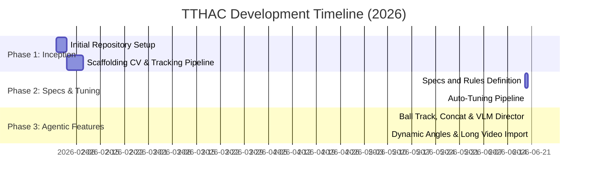

# 🗃️ TTHAC Repository Development History

This document traces the historical development timeline of the Table Tennis Highlight Clipper (TTHAC) codebase, documenting the key milestones, commits, and engineering decisions from its inception to its current advanced state.

---

## 📈 Timeline & Commits Overview

| Commit Hash | Date | Author | Commit Message / Milestone | Key Contributions |
| :--- | :--- | :--- | :--- | :--- |
| **`67aee40`** | 2026-02-02 | momonong | `Initial commit` | Base `.gitignore` configuration and initial directory structure setup. |
| **`1c53645`** | 2026-02-10 | Morris Chen | `Try to low the threshold...` | CV pipeline scaffolding; introduced YOLO-World table detection, YOLO-Pose tracking, and frame VIP scoring. |
| **`34a2f46`** | 2026-06-20 | momonong | `docs: add README and AGENT specifications...` | Defined agent rules, platform path compliance requirements, and documentation of algorithm parameters. |
| **`2d20c00`** | 2026-06-20 | momonong | `feat: integrate auto-tuning pipeline...` | Implemented `tune_pipeline.py` to auto-adjust VIP thresholds; standardized platform storage under `./storage`. |
| **`38663de`** | 2026-06-20 | momonong | `feat: implement local ball tracking...` | Integrated YOLO ball tracking, lossless highlight concatenation, and Gemini 2.5 VLM AI Director post-verification. |
| **Working Tree** | 2026-06-21 | Antigravity | *Dynamic Camera Angles & Large Importer* | Added real-time scene cut detection, aspect-ratio-aware play zones, and `import_tool.py` for long videos. |

---

## 🔍 Detailed Milestone Breakdown

### 🛠️ Phase 1: Pipeline Scaffolding (February 2026)
* **Commit: [1c53645](file:///home/ubuntu/projects/pingpong-auto-highlight/main.py#L1-L131)** (Feb 10, 2026)
* **Objective**: Create a functional local CV script to identify rallies and cut highlights from table tennis videos.
* **Architecture**:
  * **Table Detection**: Configured `TableDetector` to query `yolov8l-worldv2.pt` for the coordinate bounds of the ping pong table.
  * **Pose Tracking**: Integrated `yolo11l-pose.pt` tracking keypoints (ankles) of players in the frame.
  * **Rally State Machine**: Programmed `VIPGameTracker` which calculates "VIP score" based on the frame duration a player spends within the expanded table zone. If VIP score crosses a warmup threshold, active play is recognized and clipped using FFmpeg `-ss` and `-to` cuts.

### 📚 Phase 2: Agent Guidelines & Auto-Tuning (June 2026)
* **Commits: [34a2f46](file:///home/ubuntu/projects/pingpong-auto-highlight/README.md) & [2d20c00](file:///home/ubuntu/projects/pingpong-auto-highlight/tune_pipeline.py)** (Jun 20, 2026)
* **Objective**: Standardize system configurations and automate parameter adjustments.
* **Architecture**:
  * **Cross-platform Compliance**: Refactored settings to map storage to workspace-relative `./storage/` dirs, preventing hardcoded paths.
  * **Automated Parameter Tuner**: Built [tune_pipeline.py](file:///home/ubuntu/projects/pingpong-auto-highlight/tune_pipeline.py) using an iterative feedback loop:
    * It runs TTHAC and counts output clips.
    * If clips are too few or zero, it lowers `vip_warmup_score` and expands the core zone.
    * If clips are too many, it increases thresholds to make selection stricter.

### 🤖 Phase 3: Intelligent & Multi-Camera Enhancements (June 2026)
* **Commit: [38663de](file:///home/ubuntu/projects/pingpong-auto-highlight/main.py#L15-L146) & Current Working Changes** (Jun 20-21, 2026)
* **Objective**: Add precision tracking, automated compilation, multimodality verification, and robust camera angle handling.
* **Architecture**:
  * **Ball Tracking**: Configured `yolo11n.pt` class 32 (`sports ball`) to track the ball and measure `ball_activity_ratio` per rally to verify active play.
  * **Concatenation**: Replaced separate output folders with seamless compile clips (`final_highlight_reel.mp4`).
  * **Gemini AI Director**: Added API integration with `gemini-2.5-flash` to upload clips, filter false positives (picking up balls, walking), rate intensity, and output localized Traditional Chinese descriptions.
  * **Dynamic Camera Angles**: Added HSV histogram cut detection to handle multi-cam matches and aspect-ratio-aware core zones to automatically adjust zone dimensions for baseline, side, or diagonal camera views.
  * **Large Video Imports**: Created `import_tool.py` providing client-side H.264 video compression, YouTube/direct URL downloads, and background watch-folder automation.
