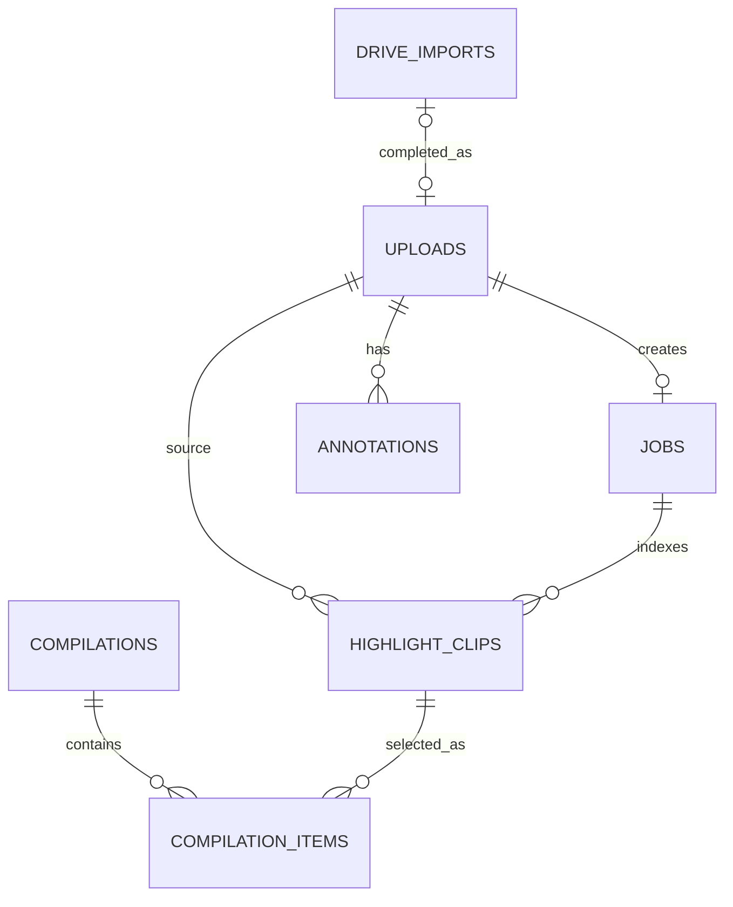

# 儲存與資料生命週期

## 短答案

HighlightCraft 採用「SQLite + 一般檔案」的混合儲存：

- SQLite `data/state.sqlite3` 保存上傳、工作、標註、片段、集錦與 pCloud archive 的索引及狀態。
- 原始影片、逐球片段、分析 JSON 與最後集錦都是 `data/` 下的實體檔案，不會以 BLOB 塞進 SQLite。
- Docker Compose 將主機的 `./data` bind mount 到容器的 `/data`。刪除或重建 container 不會刪掉主機上的資料；刪除 `./data` 則會同時失去影片與資料庫索引。

這個設計讓大影片能直接由檔案系統與 FFmpeg 使用，SQLite 則負責回答「這個 ID 對應哪個檔案、目前處理到哪裡、哪些片段是現役版本」。

## 主機與容器的路徑

| 用途 | 主機路徑 | 容器路徑 | 是否為主要資料 |
|---|---|---|---|
| 全部持久化資料 | `./data` | `/data` | 是 |
| SQLite | `./data/state.sqlite3` | `/data/state.sqlite3` | 是 |
| 原始影片 | `./data/uploads/` | `/data/uploads/` | 是 |
| 分析結果與逐球片段 | `./data/outputs/` | `/data/outputs/` | 是 |
| 自訂集錦 | `./data/compilations/` | `/data/compilations/` | 是 |

`./data` 是相對於專案根目錄，而不是 Docker volume 的匿名空間。SQLite 與 runtime media 必須視為同一份資料集；但這個 checkout 的 `data/` 也混有開發／評估目錄，所以備份時應使用後文列出的權威 runtime set，而不是忽略錯誤地打包所有內容。

## `data/` 目錄結構

```text
data/
├── state.sqlite3                 # catalog/control plane；SQLite 使用 WAL mode
├── state.sqlite3-wal             # 服務執行期間可能出現
├── state.sqlite3-shm             # 服務執行期間可能出現
├── .upload-token                 # 網頁與 API 的存取 token，需保密
├── .media-work.lock              # 分析/重建/編譯共用的跨程序媒體工作鎖
├── .archive-work.lock            # pCloud CLI 共用的獨立跨程序傳輸鎖
├── uploads/
│   ├── <random-id>.<ext>         # 完成的原始影片
│   └── <upload-id>.<ext>.part    # 尚未完成的 resumable upload
├── drive-imports/                # Google Drive 匯入中的暫存檔
├── outputs/
│   └── <job-id>/
│       ├── analysis.json         # 該次分析的結果摘要
│       ├── highlight_*.mp4       # 初次分析或舊版輸出的片段/影片
│       └── clip-sets/
│           └── <algorithm-version>-<timestamp>/
│               ├── analysis.json
│               └── highlight_*.mp4
├── compilations/
│   └── <compilation-id>/
│       └── highlight_compilation.mp4
├── work/                         # 保留給暫時性工作資料；不是權威來源
├── local-access-url.txt          # localhost 啟動器寫入的本機網址
├── remote-access-url.txt         # tunnel 啟動時寫入的外部網址
├── .ngrok-agent.yml              # 若有使用 ngrok，由啟動器產生
└── .ngrok-authtoken              # 若有使用 ngrok；需保密
```

幾個容易混淆的地方：

- `outputs/<job-id>/` 保存「某個來源影片分析出來的素材」。
- `outputs/<job-id>/clip-sets/<algorithm-version>-<timestamp>/` 是重建素材庫時產生的獨立執行目錄；資料庫的 `library_version` 是演算法版本（目前為 `highlight-library-v2`），不含該 timestamp。舊檔會留下，但資料庫會把舊列設為 `active = 0`。
- `compilations/<compilation-id>/highlight_compilation.mp4` 才是從多支來源、任意片段組成的最後自訂集錦。
- CLI `analyze` 可產生手動輸出，但不會自動登錄到網頁素材庫；要重建可管理的素材庫應使用 `rebuild-library`。
- `data/datasets/`、`evaluations/`、`real-eval/`、UI smoke 與 worktree 目錄若存在，屬於開發／評估產物，不是正式 runtime data flow。

## SQLite 裡存什麼

| 資料表 | 角色 | 重要內容 |
|---|---|---|
| `uploads` | 原片上傳紀錄 | 檔名、檔案路徑、大小、`offset`、完成狀態 |
| `jobs` | 每支來源影片的分析工作 | queued/processing/completed/failed、進度、錯誤、初次分析的 `result_json` |
| `drive_imports` | Google Drive 匯入工作 | Drive file ID/resource key、檔名、大小、offset、狀態、完成後連結的 upload |
| `annotations` | 人工標記 | 來源影片、start/end 範圍、標籤、備註 |
| `highlight_clips` | 可管理的逐球素材索引 | 來源、檔案路徑、開始/結束時間、分數、排名、版本、`active` |
| `compilations` | 自訂集錦工作 | 名稱、狀態、輸出檔名、實際總時長、錯誤與 timestamps |
| `compilation_items` | 集錦與片段的關聯 | compilation、clip、排列順序 |
| `storage_objects` | 本機影片與 pCloud archive 的對照 | owner、relative local path、remote alias/path/file ID/region/account/root、雙狀態、hash、attempt/error/timestamps |

影片本體不在這些資料表中。API 先用資料庫把 upload/job/clip/compilation ID 解析成檔案路徑，再確認路徑仍位於允許的資料目錄內，最後以支援 HTTP Range 的方式串流 MP4。



SQLite 使用 WAL mode，適合目前單機、單一 web service process 加背景 worker 的部署方式。它不是為多台機器共同寫入同一個 `data/` 所設計；若未來要水平擴充，應把 metadata 遷到 PostgreSQL、影片移到 object storage，並把工作佇列拆成獨立服務。

## 一支影片從進來到集錦的生命週期

1. 直接上傳時，瀏覽器把 chunks 寫入 `uploads/<upload-id>.<ext>.part`，`uploads.offset` 記錄續傳位置。完成後檔案改成正式檔名並建立 job。
2. Google Drive 匯入時，背景 worker 先下載到 `drive-imports/`；完成後移入 `uploads/`，建立 upload 與 job 關聯。
3. Job worker 讀取原片；現行 heuristic baseline 的 audio/motion/NumPy 分析在 CPU，GPU 用於 FFmpeg NVDEC 解碼與 NVENC 輸出，失敗時可退回 CPU。片段寫入 `outputs/<job-id>/`，結果與片段索引再寫入 SQLite。
4. `rebuild-library` 會在新的 `clip-sets/<algorithm-version>-<timestamp>/` 完整產生片段。只有全部成功後，才在同一個資料庫 transaction 中停用舊列並啟用新列；失敗時不會把半套結果切成現役素材庫。
5. API 從 SQLite 讀取 `highlight_clips.active = 1` 與 metadata；日期、分數、來源與長度的篩選排序目前由瀏覽器端完成，不會掃描資料夾。
6. 建立集錦時，選取順序寫入 `compilation_items`，背景 worker 以 FFmpeg concat filter 正規化不同素材並重新編碼，以 hard cut 產生 `compilations/<id>/highlight_compilation.mp4`。

分析、素材庫重建與集錦輸出會共用 `data/.media-work.lock`，避免多個 FFmpeg/GPU 工作同時搶資源。服務重啟後，背景管理器會從 SQLite 恢復可恢復的 queue 狀態。

## 版本、保留與刪除行為

- 素材庫的「目前版本」由 `highlight_clips.active` 決定，不是由最新檔案時間決定。
- 重建素材庫不會覆寫初次 job 的 `jobs.result_json`，所以工作卡片可保留當時結果，而素材庫顯示目前 active 片段。
- 重建也不會自動刪除舊 clip-set；舊資料列設為 inactive、舊 MP4 留在磁碟，以便稽核或回溯。
- 自訂集錦與原始影片目前也沒有自動 retention/garbage collection。
- 目前 UI/API 只支援刪除未完成的直接上傳，以及 queued/failed 的 Drive import；不支援直接刪除已完成來源、job、clip-set 或 compilation。

因此，不要只從檔案總管手動刪除 active MP4：SQLite 仍會指向該路徑，播放器與下載就會失敗。需要清容量前，應先加入一個能同時檢查關聯、更新資料庫並刪檔的正式 cleanup 流程。

## pCloud 長期保存方案（第一階段已實作）

pCloud 適合成為影片的長期主要儲存，但不應直接取代本機工作目錄。目標流程是「Google Drive 送件 + 本機處理 cache + pCloud no-overwrite video archive」：

```text
Pixel 手機
    │ Google Drive Android 上傳
    ▼
Google Drive 送件箱（暫存，可在歸檔完成後刪除）
    │ 現有 Drive importer 下載、完整落盤
    ▼
桌機 local cache ── CPU analysis + GPU/FFmpeg ── clips / compilations
    │                                           │
    └──────────── 非同步 copy + checksum ───────┘
                              ▼
                 pCloud 長期影片 archive
                              │
                    需要時 hydrate 回本機
```

| 層級 | 定位 | 保存多久 |
|---|---|---|
| Google Drive | Pixel 最方便的 ingress／handoff | pCloud 原片驗證完成前 |
| 桌機 `data/` | processing workspace 與近期 hot cache | 工作中；之後依 cache policy |
| pCloud | 原片與影片結果的長期 primary archive | 依使用者 retention 決定 |
| 本機 SQLite | live catalog、標記、關聯與狀態 | 長期；另做小型 point-in-time snapshot |

[pCloud Android App](https://help.pcloud.com/article/uploading-downloading-organizing) 也支援手動上傳、Android Gallery 分享與 Automatic Upload，可保留成備援 ingress；但目前 Google Drive 已有可運作的 importer，而且 [Google Drive Android](https://support.google.com/drive/answer/2424368?co=GENIE.Platform%3DAndroid) 原生上傳路徑清楚，所以第一版不需要同時維護兩套手機入口。

目前 `pcloud bootstrap` 建立的遠端結構：

```text
/HighlightCraft/
├── inbox/                                      # 可選的 pCloud 手機備援入口
└── archive-v1/
    ├── originals/<YYYY>/<MM>/<recorded-at>--<upload-id>/
    │   ├── <recorded-at>--original--<short-upload-id>.<ext>
    │   └── manifest.json
    ├── highlight-clips/<YYYY>/<MM>/<upload-id>/<library-version>/
    │   ├── <rank>--clip--<clip-id>.mp4
    │   └── <rank>--clip--<clip-id>.json
    ├── compilations/<YYYY>/<MM>/<created-at>--<compilation-id>/
    │   ├── <created-at>--<name>--c-<short-compilation-id>.mp4
    │   └── manifest.json
    ├── database-snapshots/                     # 預留；尚未自動產生
    ├── _staging/<storage-object-id>/           # crash-safe transfer 暫存
    └── _quarantine/                            # 預留給人工處理衝突
```

`archive-v1` 是命名 contract，不是模型版本。遠端保留版本化 namespace，讓未來可以設計 `archive-v2` 而不必覆寫 v1；但第一階段 catalog 對每個 owner 只允許一個 archive identity，不能只改常數就直接切版。改命名版本或 `PINGPONG_PCLOUD_ROOT` 前，必須先有明確的 catalog migration；系統會拒絕把同一份 catalog 混寫到另一個根目錄。日期優先取 Pixel 檔名解析出的 device wall-clock `recorded_at`；沒有才用 catalog `created_at`。系統不猜測時區、場次、地點或對手。原始手機檔名、local relative path、owner ID、影片大小、SHA-1/SHA-256 與來源 metadata 都放在 UTF-8 JSON manifest；正式影片名稱不直接沿用可能重複、有空格或平台限制字元的手機檔名。

應保存的內容：

- 原片：必存。它是重新分析、重新切片與人工標記的唯一來源。
- active clips：建議存。雖然可由原片重建，但保留後能快速恢復素材庫且不用再次耗費 GPU 時間。
- final compilations：必存。這是使用者真正要分享的成品。
- inactive／失敗 run 的 clips：可設定較短 retention；先保留，等正式 cleanup 能理解 DB 關聯後再刪。
- `analysis.json`、設定／版本 manifest 與 SQLite snapshot：體積很小，一起存能讓影片可追溯。live SQLite 仍在本機，不從 pCloud mount 開啟。

第一階段已用 [rclone 的原生 pCloud backend](https://rclone.org/pcloud/) 做 operator-run archive。`scripts/setup-pcloud.{sh,ps1}` 會從官方 release 下載並驗證固定的 rclone 1.75.0，在運算電腦以瀏覽器完成一次 OAuth 授權；不需要 pCloud API key，也不會保存 pCloud 密碼。設定檔固定在 Git 與 Docker build context 排除的 `secrets/rclone/rclone.conf`，而且只讀掛到沒有 port、手動啟動的 `pcloud-admin` container；常駐網站 container 不持有它。pCloud OAuth token 目前不會自動過期，因此這個檔案要視為長期密鑰、不要輸出到 log 或備份進一般媒體 archive。

pCloud 帳號有 US/EU API endpoint，`pcloud doctor` 從 rclone redacted config 讀取 hostname，實際列出遠端根目錄後才回報區域。rclone/pCloud 兩區共同支援 SHA-1，US 另有 MD5、EU 另有 SHA-256；本機會一次計算 SHA-1 + SHA-256，遠端一致性使用共同的 size + SHA-1，完整 SHA-256 留在 SQLite 與 manifest。[pCloud API](https://docs.pcloud.com/) 本身也支援 OAuth、file IDs、上下載與 checksum；只有未來不再沿用 rclone token、改成由本系統自行完成 OAuth app flow 時，才需要另外建立 app/client ID/client secret。

不要採以下捷徑：

- 不要把 live `state.sqlite3` 放在 pCloud Drive、WebDAV 或 rclone mount。雲端檔案系統的延遲寫回與鎖定語意不符合 SQLite；只上傳服務停止後或由 SQLite backup API 產生的 immutable snapshot。
- 不要讓 FFmpeg 直接對雲端 mount 的大型原片工作。先完整下載到 `.part`，驗證 size/hash，再 atomic rename 進 `uploads/`。
- 不要用 `rclone sync` 當 archive，因為它會讓遠端跟著刪除；使用不刪 destination 的 [`rclone copy`](https://rclone.org/commands/rclone_copy/)，遠端路徑採 UUID／run ID，避免覆寫。
- 不以 WebDAV 作主要大型影片管道。pCloud 雖提供 [WebDAV](https://help.pcloud.com/article/webdav)，但 OAuth/rclone 比保存帳號密碼更適合本系統，也能提供 provider-aware checksum 與 file ID。
- 不把 pCloud 公開連結當網站影片 CDN；它可作備援匯入，但分享流量和權限是另一個限制面。

公開連結 Drive importer 目前沒有可比對的 Drive cryptographic checksum；它只確認下載成功、大小／空間限制並完整移入 upload store。正式 archive worker 要另外計算本機整檔 hash，再與 pCloud 兩個區域都支援的共同 hash 比對。

SQLite 現已新增 additive `storage_objects` catalog，記錄 `media_kind`、owner type/ID、可搬機的 `local_relative_path`、provider/remote alias/region/hostname/account/root、remote file ID/path、manifest path、byte size、local SHA-1/SHA-256、provider checksum、attempt/error，以及 uploaded/verified/last-checked timestamps。Remote archive 與本機 availability 是兩個正交狀態：

```text
archive_state = pending | queued | uploading | verifying | verified | failed
local_state   = present | evicting | evicted | restoring | missing
```

`evicted` 表示使用者有意釋放而且能還原；`missing` 表示 DB 認為應在本機但檔案意外消失。現行 archive 先拒絕空檔或與 catalog 大小不符的來源，再算本機 hash，以 `copyto --ignore-existing` 傳到 `_staging/<storage-object-id>/` 並核對 size/SHA-1。finalize 直接沿用 rclone OAuth token 呼叫 pCloud 官方 `copyfile` 並設定 `noover=1`，由 provider 拒絕同名覆寫；final 影片與 manifest 再驗證後，才刪除 hash 相同的 staging object 並 commit `verified`。若程序在 remote finalize 後、DB commit 前中斷，重跑會辨識相同 final checksum 並接續 manifest/DB；若 final 同名但 checksum 不同，整筆轉 `failed` 並保留本機與既有 final 供人工處理。

這不是 pCloud 供應商層的 WORM：使用者仍可從其他 client 手動改名、覆寫或刪除。`pcloud verify` 會以 catalog 中已完成過驗證的所有 object（包含後來 inactive 的 clip）重新檢查影片與 manifest；remote 缺失或 checksum drift 會標成 `failed`，暫時性錯誤修復後可以重跑並恢復成 `verified`。第一次開始傳輸就會固定該物件的 size、影片 hash 與 manifest hash；第一次成功傳輸也會鎖定 rclone remote alias、region、pCloud account ID、backend root folder ID 與 `PINGPONG_PCLOUD_ROOT` 路徑，避免重試、換帳號或換 root 後把不同內容混進同一份 catalog。

刪除規則必須由狀態機執行：

1. Google Drive 原片只有在 pCloud `original` size/hash 驗證完成後，才顯示「現在可從 Drive 刪除」。公開連結模式沒有刪除 Drive 的權限，因此第一版由使用者手動刪。
2. 桌機原片只有在 remote verified、DB remote record 已提交，而且按需 restore/hydrate 已可用時，才提供「釋放本機空間」。
3. clips 與 compilations 同樣要先 remote verified；被播放器或 compilation worker 使用中時不能 eviction。清理順序先從 inactive 且未被 compilation 引用的舊 clip-set 開始，active clips 與 final compilations 最後處理。
4. pCloud 上的影片刪除是另一個明確操作，不能因清 local cache 或使用 `rclone sync` 被連帶刪除。

目前 archive 由明確 CLI 操作啟動，不會因 web service 開機就突然上傳全部舊資料。先以 `pcloud plan` 做不傳輸、不登記 object 的盤點，再用 `pcloud archive --kind highlight --limit 1 --execute` 測試小檔；確認後才逐批送原片。第一次由新版程式開啟 SQLite 時仍會執行 additive schema migration。執行前應確認 FFmpeg media work idle，避免同時大量讀同一顆磁碟。任何 pCloud 上傳或驗證失敗只會成為 `archive_state=failed`、本機仍保持 `present`（檔案確實不存在時則為 `missing`），不影響 upload/job/compilation，也不能觸發 Drive 或 local cleanup。

目前程式仍假設所有 player/annotation/rebuild/compilation 需要的 media 都在本機。雖然 `storage_objects` 與 remote verification 已完成，restore/hydration 還沒有，所以 **不能現在就手動刪除 `data/uploads`、active clips 或 compilations**；否則播放器、人工標記和重跑都會失敗。第二階段要加入 on-demand hydration，第三階段才開放安全 eviction。遠端-only 素材在 UI 應顯示「從 pCloud 取回」與進度，而不是一般 404；新 compilation 送出前也要 preflight 並 hydrate 所有缺少的 clips。播放器中的檔案還需要 lease/refcount 或保守 TTL，避免 Windows 上仍在 Range 播放時被刪除。

pCloud 的 Lifetime 容量能改善長期成本，但仍是單一帳號／供應商，不等於完整備份。最重要的原片和 SQLite snapshot 最好另留第二份離線硬碟或未來主機副本。pCloud 的 Trash/Revisions/Rewind 也有方案相關的保留期間，不應被當作永久版本庫；參考官方 [File Recovery and History](https://help.pcloud.com/article/file-recovery-and-history)。

## 備份與復原

邏輯上必須一起備份 SQLite 與 runtime media；只備份資料庫會留下沒有影片的索引，只備份影片則會失去狀態、標註與片段排序。目前 `data/` 也混有 `datasets/`、evaluation、UI smoke、npm cache 與 worktrees 等開發產物，部分目錄可能有不同 ACL，所以不要用會忽略錯誤的「直接 zip 整個 data」當成成功備份。

權威 runtime set 是 `state.sqlite3*`、`uploads/`、`drive-imports/`、`outputs/`、`compilations/` 與 `.upload-token`。`published-image.txt` 可一起保存作 provenance；`local-access-url.txt`、`remote-access-url.txt`、`.media-work.lock` 和 `.archive-work.lock` 可重建，不是 restore 必要資料。`.ngrok-authtoken` 與專案外層 `secrets/rclone/rclone.conf` 是帳號 secret，若要保存應另行加密，不要混進一般媒體 archive。

備份前先在頁面確認 upload、Drive import、來源分析與 compilation 全部 idle，再停止服務，避免剛好複製到 SQLite transaction 或尚未完成的影片：

PowerShell：

```powershell
$ErrorActionPreference = "Stop"
$restartNeeded = $false
$failureMessage = $null
try {
    $restartNeeded = $true
    docker compose stop pingpong-highlight
    if ($LASTEXITCODE -ne 0) { throw "docker compose stop failed ($LASTEXITCODE)" }

    $stamp = Get-Date -Format "yyyyMMdd-HHmmss"
    $backupRoot = "D:\backups\highlightcraft-$stamp"
    $backupData = Join-Path $backupRoot "data"
    New-Item -ItemType Directory -Path $backupData | Out-Null
    foreach ($name in @("uploads", "drive-imports", "outputs", "compilations")) {
        Copy-Item -LiteralPath (Join-Path ".\data" $name) -Destination $backupData -Recurse
    }
    foreach ($name in @("state.sqlite3", "state.sqlite3-wal", "state.sqlite3-shm", ".upload-token", "published-image.txt")) {
        $source = Join-Path ".\data" $name
        if (Test-Path -LiteralPath $source) {
            Copy-Item -LiteralPath $source -Destination $backupData
        }
    }
    Get-ChildItem -LiteralPath $backupData -File -Recurse |
        Get-FileHash -Algorithm SHA256 |
        Select-Object Path, Hash |
        Export-Csv -NoTypeInformation -Path (Join-Path $backupRoot "SHA256SUMS.csv")
}
catch {
    $failureMessage = $_.Exception.Message
}
finally {
    if ($restartNeeded) {
        try {
            docker compose start pingpong-highlight
            if ($LASTEXITCODE -ne 0) {
                throw "docker compose start failed ($LASTEXITCODE)"
            }
        }
        catch {
            $restartFailure = $_.Exception.Message
            $failureMessage = if ($failureMessage) {
                "$failureMessage; $restartFailure"
            } else {
                $restartFailure
            }
        }
    }
}
if ($failureMessage) { throw $failureMessage }
```

Git Bash：

```bash
set -euo pipefail
restart_needed=0
restart_service() {
  status=$?
  trap - EXIT
  if [ "$restart_needed" -eq 1 ] && ! docker compose start pingpong-highlight; then
    echo "docker compose start failed; service is still stopped" >&2
    [ "$status" -ne 0 ] || status=1
  fi
  exit "$status"
}
trap restart_service EXIT
restart_needed=1
docker compose stop pingpong-highlight
backup_dir="/d/backups/highlightcraft-$(date +%Y%m%d-%H%M%S)"
mkdir -p "$backup_dir/data"
cp -a ./data/state.sqlite3 ./data/.upload-token \
  ./data/uploads ./data/drive-imports ./data/outputs ./data/compilations \
  "$backup_dir/data/"
for file in ./data/state.sqlite3-wal ./data/state.sqlite3-shm ./data/published-image.txt; do
  [ ! -f "$file" ] || cp -a "$file" "$backup_dir/data/"
done
(cd "$backup_dir" && find data -type f -print0 | sort -z | xargs -0 sha256sum > SHA256SUMS)
```

每次 destination 都必須是新的空目錄；任何 unreadable file、複製或 hash 錯誤都應讓備份失敗，不能留下「看似成功」的 archive。如果使用 release 或 localhost overlay，停止與啟動時沿用原本同一組 Compose files。

復原時先停止服務，驗證 manifest，並把目前資料另外保留；只能復原到新的空 `data/`，不要把兩個 snapshot 疊在一起。啟動前做 SQLite `quick_check`／foreign key check 與 DB-referenced media existence check，啟動後再檢查 `/api/health`、素材庫、標註、Range 播放，以及（若已有）一支 compilation。現階段還沒有封裝完成且自動驗證的 backup/restore script，以上是人工基準流程。

## 容量規劃

磁碟使用量主要來自三份內容：原片、每次重建保留的逐球 MP4，以及使用者建立的集錦。SQLite 通常只佔很小一部分。現階段應至少：

- 定期備份完整的權威 runtime set，並驗證 checksum；pCloud archive 不能取代第二份備份。
- 在重跑長影片前確認剩餘容量，因為新 clip-set 成功前舊版本仍會保留。
- 把自動清理視為後續獨立功能，而不是用手動刪檔代替。
